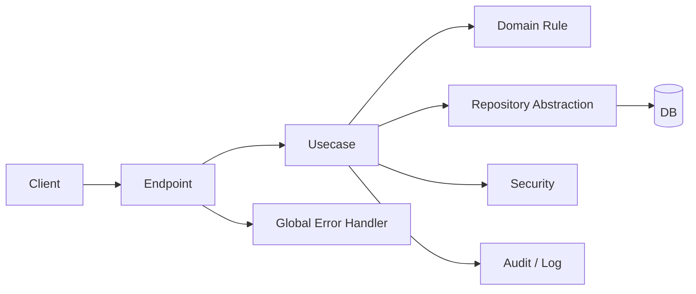
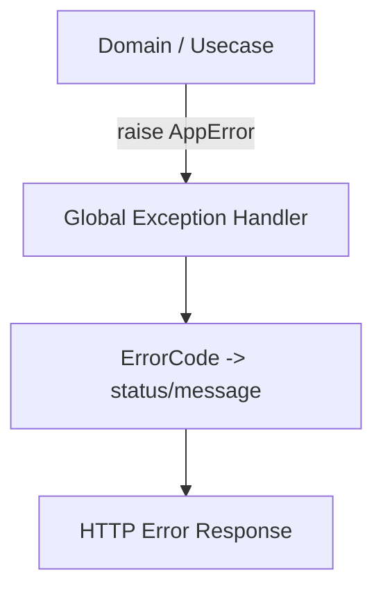
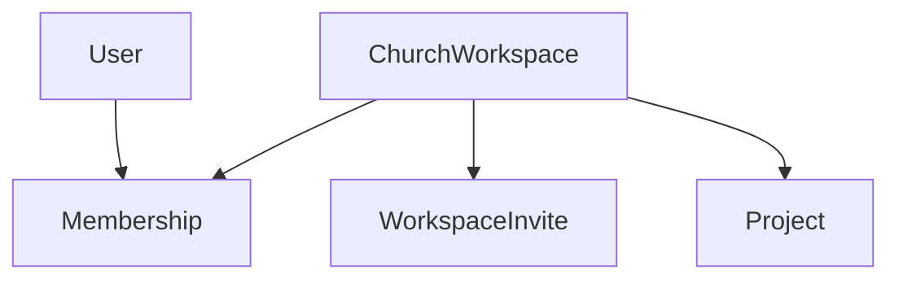

# Architecture Decisions

> 구현 시 참고하는 기준 문서다.  
> 목적은 `결정을 많이 모아두는 것`이 아니라, **팀원과 AI가 같은 규칙으로 구현하게 만드는 것**이다.

---

## Decision Dashboard

| 영역      | 핵심 결정                                              | 상태 |
| --------- | ------------------------------------------------------ | ---- |
| 대화/기준 | 현재 확정한 대화가 최상위 기준                         | [x]  |
| 레이어    | `endpoint -> usecase -> domain/repository -> database` | [x]  |
| 트랜잭션  | `usecase 1개 = 기본 transaction 1개`                   | [x]  |
| 에러      | `AppError + ErrorCode + 전역 변환`                     | [x]  |
| 성공 응답 | `{"data": ...}`                                        | [x]  |
| 에러 응답 | `{"error": {"code","message","request_id"}}`           | [x]  |
| 로그      | application / audit / security 목적 분리               | [x]  |
| DB        | app id, UTC, soft delete, FK, 제약 적극 사용           | [x]  |
| 인증      | cookie + refresh + CSRF + rotation                     | [x]  |
| 소유권    | `Project`는 `ChurchWorkspace` 소유                     | [x]  |
| 권한      | `owner / admin / editor / viewer`                      | [x]  |
| 구현 순서 | `Auth -> Refresh/Audit -> Workspace -> Project`        | [x]  |

---

## System Picture



---

## 1. 공통 원칙

| 항목               | 결정                                     | 이유                                         |
| ------------------ | ---------------------------------------- | -------------------------------------------- |
| 비즈니스 API       | 기본적으로 모두 usecase를 거친다         | 표현 레이어에 판단 로직이 쌓이지 않게 하려고 |
| usecase 인터페이스 | 기본값으로 두지 않는다                   | 구현 하나인 경우 설명 비용만 커지기 때문     |
| repository 추상화  | 상위 계층은 구현이 아니라 추상화만 안다  | 저장 기술 의존을 줄이기 위해                 |
| Domain Service     | 객체 하나에 자연스럽게 못 넣을 때만 쓴다 | 빈약한 도메인 모델을 막기 위해               |
| 용어 기준          | 기술 용어보다 업무 언어를 우선           | 도메인 경계를 코드 이름에서도 유지하려고     |

### 코드 기준 체크리스트

- [x] endpoint는 입력/출력만 다룬다
- [x] usecase는 흐름을 조립한다
- [x] domain은 자기 규칙을 가진다
- [x] repository는 저장 구현을 숨긴다

---

## 2. 레이어와 요청 흐름

### 기본 흐름

```text
presentation(endpoint) -> application(usecase) -> domain/repository -> database
```

### 세부 결정

| 주제                  | 결정                                              | 이유                                          |
| --------------------- | ------------------------------------------------- | --------------------------------------------- |
| 조회 API              | 조회도 비즈니스 의미가 있으면 usecase를 거친다    | 권한/정책/없음 처리 규칙이 있기 때문          |
| health/metrics        | usecase 예외 가능                                 | 비즈니스 규칙이 없는 기술성 endpoint이기 때문 |
| usecase와 transaction | 같은 개념이 아니다                                | usecase는 흐름, transaction은 원자성 장치다   |
| 여러 aggregate 수정   | 가능, 단 불변식이 함께 걸릴 때만 같은 transaction | DDD 경계와 실무 유연성을 같이 맞추기 위해     |

---

## 3. 트랜잭션

| 항목             | 결정                            | 이유                                          |
| ---------------- | ------------------------------- | --------------------------------------------- |
| 기본 경계        | `usecase 1개 = transaction 1개` | 비즈니스 원자성 기준                          |
| 읽기 usecase     | 기본적으로 transaction 없음     | 불필요한 비용 감소                            |
| 판단 기준        | `같이 성공/실패해야 하는가`     | 테이블 기준보다 의미 기준이 맞기 때문         |
| 외부 시스템 호출 | 핵심 DB transaction과 분리      | 외부 장애가 핵심 기능을 망치지 않게 하려고    |
| audit log        | 핵심 transaction과 분리         | 감사 로그 실패가 주 기능을 뒤집지 않게 하려고 |

### 구현 메모

- 현재 SQLite 버전은 저장소 메서드 단위 커밋이지만, 아키텍처 기준은 여전히 `usecase 단위`다.
- 실제 RDBMS/UoW로 올릴 때도 기준은 바뀌지 않는다.

---

## 4. 예외 / 에러

### 구조



### 핵심 결정

| 항목             | 결정                                    | 이유                    |
| ---------------- | --------------------------------------- | ----------------------- |
| 하위 레이어 예외 | `AppError`만 사용                       | 웹 프레임워크 의존 제거 |
| 에러 코드        | 전역 `ErrorCode` enum 하나              | 중복과 충돌 방지        |
| 네이밍           | 공통은 `COMMON_*`, 도메인은 접두사 강제 | 의미 경계 유지          |
| status/message   | 전역 매핑 한 곳 관리                    | endpoint별 흔들림 방지  |
| context          | 내부 로그/추적용만 허용                 | 민감정보 노출 방지      |
| 예상 못한 예외   | `COMMON_INTERNAL_SERVER_ERROR`로 통일   | 외부 계약 단순화        |
| request_id       | 외부 에러 응답에 포함                   | 문의/로그 추적 연결     |

### 응답 규칙

#### 성공

```json
{
  "data": {}
}
```

#### 실패

```json
{
  "error": {
    "code": "AUTH_INVALID_CREDENTIALS",
    "message": "Invalid email or password.",
    "request_id": "req_123"
  }
}
```

#### validation 실패

```json
{
  "error": {
    "code": "COMMON_VALIDATION_ERROR",
    "message": "Validation failed.",
    "request_id": "req_123",
    "errors": [
      { "code": "AUTH_EMAIL_INVALID_FORMAT", "field": "email" },
      { "code": "AUTH_PASSWORD_TOO_SHORT", "field": "password" }
    ]
  }
}
```

### 추가 규칙

- [x] 입력 검증 실패와 도메인 규칙 실패는 분리
- [x] 인증 안 됨과 권한 없음은 분리
- [x] 로그인 자격 증명 실패는 `AUTH_INVALID_CREDENTIALS`로 뭉친다
- [x] 비활성 계정은 `AUTH_USER_NOT_ACTIVE`로 분리
- [x] 중복 리소스는 도메인별 세부 코드 사용

---

## 5. 로그

| 항목           | 결정                                     | 이유                                      |
| -------------- | ---------------------------------------- | ----------------------------------------- |
| 로그 종류      | application / audit / security 목적 분리 | 운영 의미를 분리하기 위해                 |
| 형식           | 구조화 이벤트 중심                       | 검색/집계/추적을 위해                     |
| 민감정보       | 원문 금지, hash/masked만 허용            | 로그가 민감정보 저장소가 되지 않게 하려고 |
| 최종 에러 로그 | 전역 처리기가 남긴다                     | 중복/누락 방지                            |
| 발생 지점 로그 | audit 같은 예외적 경우만 허용            | 중복 에러 로그 방지                       |
| 5xx            | error                                    | 서버 장애 신호                            |
| 4xx            | info 또는 warning                        | 운영 심각도 분리                          |
| audit 실패     | 주 기능 결과를 뒤집지 않음               | 운영성과 안정성 확보                      |

---

## 6. API 응답 / URL 규칙

| 항목             | 결정                       | 이유                                           |
| ---------------- | -------------------------- | ---------------------------------------------- |
| 성공 형식        | `{"data": ...}`            | 프론트/AI 구현 규칙 고정                       |
| meta             | 필요할 때만                | 빈 껍데기 응답 방지                            |
| 204 사용         | 기본값으로 두지 않음       | 응답 계약 단순화                               |
| 데이터 없음 판단 | API 의도로 판단            | 단일 조회/존재 확인/목록 조회를 구분하기 위해  |
| URL 기본         | 자원 명사 중심             | REST 기본 규칙 유지                            |
| 예외 URL         | auth 같은 행위성 흐름 허용 | `login`, `refresh`는 행위 자체가 의미이기 때문 |
| pagination       | 초기 기본은 `offset/limit` | 구현/운영 단순성                               |

---

## 7. Validation 규칙

| 층위               | 무엇을 검증하는가              |
| ------------------ | ------------------------------ |
| presentation       | 형식, 필수값, null, 기본 범위  |
| domain             | 객체 자기 자신의 규칙          |
| policy/application | 사용자-자원 관계, 접근 정책    |
| system             | 재시도, 중복 방지, 동기화 규칙 |

### 예시

- `user.ensure_can_login()` -> 도메인 규칙
- `project_policy.can_edit(user, project)` -> 정책 규칙

---

## 8. 인증 / 세션

### Auth Scope

- [x] `POST /auth/signup`
- [x] `POST /auth/login`
- [x] `POST /auth/refresh`
- [x] `POST /auth/logout`
- [x] `GET /users/me`
- [x] `POST /users/me/withdraw`

### 핵심 정책

| 항목             | 결정                                 | 이유                            |
| ---------------- | ------------------------------------ | ------------------------------- |
| 가입 정책        | 공개 signup                          | 초기 진입 단순화                |
| signup 필드      | `email + password + name`            | 최소 식별 정보 확보             |
| signup 성공 직후 | 자동 로그인 없음                     | 계정 생성과 인증 분리           |
| 세션 전달        | `HttpOnly cookie + refresh token`    | 브라우저 흐름에 적합            |
| CSRF             | SameSite + CSRF token 검증           | 쿠키 기반 인증의 기본 위협 대응 |
| refresh 저장     | hash만 저장                          | DB 유출 리스크 감소             |
| refresh rotation | 매 요청마다 교체                     | 탈취 세션 노출 시간 축소        |
| refresh reuse    | 해당 사용자 세션 전체 revoke         | 재사용을 탈취 신호로 보기 때문  |
| logout           | 현재 refresh revoke + 쿠키 삭제      | 클라이언트/서버 세션 동시 종료  |
| password 정책    | 최소 길이 + 문자/숫자 조합           | 과도한 가입 마찰 방지           |
| 비밀번호 재설정  | 초기 범위 제외                       | 첫 auth 구조 안정화 우선        |
| 회원 탈퇴        | `deactivated + deleted_at + archive` | 자산 보존과 계정 생애주기 분리  |

---

## 9. DB 정책

### 저장 정책

| 항목             | 결정                                  | 이유                      |
| ---------------- | ------------------------------------- | ------------------------- |
| ID 생성          | 애플리케이션                          | 저장 전 객체 정체성 확보  |
| 시간 저장        | UTC                                   | 운영/환경 차이 정리       |
| 삭제 정책        | soft delete 기본                      | 복구/이력 보존            |
| soft delete 예외 | token/log/version row는 별도 생명주기 | 데이터 성격이 다르기 때문 |
| DB 제약          | NOT NULL, UNIQUE, CHECK 적극 사용     | 마지막 정합성 방어선      |
| FK               | 핵심 참조 관계 기본 적용              | 참조 무결성 보장          |

### 현재 테이블

- [x] `users`
- [x] `refresh_tokens`
- [x] `auth_audit_logs`
- [x] `user_archives`
- [x] `workspaces`
- [x] `memberships`
- [x] `workspace_invites`
- [x] `projects`

---

## 10. 협업 모델



### 핵심 결정

| 항목                             | 결정                               | 이유                              |
| -------------------------------- | ---------------------------------- | --------------------------------- |
| 소유권                           | `Project`는 `ChurchWorkspace` 소유 | 교회 공동 자산이기 때문           |
| 개인 역할                        | `User`는 계정 주체                 | 자산 소유와 분리하려고            |
| 참여 방식                        | invite code/link                   | 초기 협업 진입 단순화             |
| 참여 직후 상태                   | `active`                           | 승인 단계 없이 빠르게 시작        |
| 참여 기본 역할                   | `viewer`                           | 기본 권한 최소화                  |
| 역할                             | `owner / admin / editor / viewer`  | 초기 권한 모델 단순화             |
| 프로젝트 권한 기준               | workspace membership               | 프로젝트별 ACL 복잡도 지연        |
| 다중 소속                        | 허용                               | 교회/사역팀 다중 참여 가능성 때문 |
| 같은 workspace active membership | 1개만 허용                         | 중복 상태 방지                    |
| workspace 이름                   | 전역 unique 아님                   | 이름 중복 현실 반영               |

### 권한 표

| 역할   | 조회 | 프로젝트 생성/수정 | 프로젝트 삭제 | 초대/멤버 관리 | workspace 삭제 |
| ------ | ---- | -----------------: | ------------: | -------------: | -------------: |
| viewer | 가능 |               불가 |          불가 |           불가 |           불가 |
| editor | 가능 |               가능 |          불가 |           불가 |           불가 |
| admin  | 가능 |               가능 |          가능 |      일부 가능 |           불가 |
| owner  | 가능 |               가능 |          가능 |           가능 |           가능 |

---

## 11. Membership 생애주기

| 상태      | 의미                 | 재참여          |
| --------- | -------------------- | --------------- |
| `active`  | 현재 소속됨          | 해당 없음       |
| `left`    | 자발적으로 떠남      | 가능            |
| `removed` | 관리자에 의해 제거됨 | 기본적으로 불가 |

### owner 규칙

- [x] 마지막 owner는 다른 owner 없이 leave 불가
- [x] 마지막 owner는 다른 owner 없이 remove 불가
- [x] 예외적으로 workspace 자체를 삭제하는 것은 허용

---

## 12. Workspace / Project 흐름

### Workspace

| 흐름          | 결정                                         |
| ------------- | -------------------------------------------- |
| 생성          | 인증 사용자 가능, 생성자는 첫 owner          |
| 참여          | invite code 사용 즉시 active membership 생성 |
| role 변경     | owner/admin 기준으로 제한                    |
| leave         | 마지막 owner는 불가                          |
| member remove | removed 상태로 전이                          |
| delete        | owner만 가능, 하위 project도 soft delete     |

### Project

| 흐름                     | 결정                      |
| ------------------------ | ------------------------- |
| 생성                     | owner/admin/editor        |
| 조회                     | workspace membership 기준 |
| 수정                     | owner/admin/editor        |
| 삭제                     | owner/admin               |
| 상세 없는 workspace 조회 | `WORKSPACE_NOT_FOUND`     |

---

## 13. 구현 순서

```text
1. Auth + User
2. RefreshToken + AuthAuditLog
3. ChurchWorkspace + Membership + WorkspaceInvite
4. Project
5. Template / Render
```

### 이유

- 인증 주체가 먼저 있어야 한다.
- 그 다음 자산 소유 주체인 workspace가 있어야 한다.
- 그 위에 협업 자산인 project를 올리는 것이 가장 설명과 구현이 쉽다.

---

## 14. 현재 구현된 범위

### 실제 동작 API

- auth:
  - `signup / login / refresh / logout / me / withdraw`
- workspace:
  - `create / join / invite create / role change / leave / remove / delete`
- project:
  - `create / list / update / delete`

### 코드 앵커

- 전역 에러 처리: [core/http.py](/Users/oseongjin/Documents/Sungjin/church/dev/ws/ws-architecture/backend/app/core/http.py:30)
- DB 초기화: [core/database.py](/Users/oseongjin/Documents/Sungjin/church/dev/ws/ws-architecture/backend/app/core/database.py:131)
- auth:
  - [SignupUsecase](/Users/oseongjin/Documents/Sungjin/church/dev/ws/ws-architecture/backend/app/domains/auth/usecase.py:22)
  - [LoginUsecase](/Users/oseongjin/Documents/Sungjin/church/dev/ws/ws-architecture/backend/app/domains/auth/usecase.py:56)
  - [RefreshUsecase](/Users/oseongjin/Documents/Sungjin/church/dev/ws/ws-architecture/backend/app/domains/auth/usecase.py:124)
  - [LogoutUsecase](/Users/oseongjin/Documents/Sungjin/church/dev/ws/ws-architecture/backend/app/domains/auth/usecase.py:168)
- user:
  - [WithdrawCurrentUserUsecase](/Users/oseongjin/Documents/Sungjin/church/dev/ws/ws-architecture/backend/app/domains/user/usecase.py:14)
- workspace:
  - [CreateWorkspaceUsecase](/Users/oseongjin/Documents/Sungjin/church/dev/ws/ws-architecture/backend/app/domains/workspace/usecase.py:26)
  - [UpdateMembershipRoleUsecase](/Users/oseongjin/Documents/Sungjin/church/dev/ws/ws-architecture/backend/app/domains/workspace/usecase.py:109)
- project:
  - [CreateProjectUsecase](/Users/oseongjin/Documents/Sungjin/church/dev/ws/ws-architecture/backend/app/domains/project/usecase.py:20)
  - [UpdateProjectUsecase](/Users/oseongjin/Documents/Sungjin/church/dev/ws/ws-architecture/backend/app/domains/project/usecase.py:80)

---

## 상세 메모

<details>
<summary><strong>ErrorCode 규칙</strong></summary>

- 공통 코드는 `COMMON_*`
- 도메인 코드는 항상 접두사 강제
- 같은 HTTP status라도 의미가 다르면 도메인별 코드로 분리
- 사용자 메시지는 예외 발생 지점에서 직접 만들지 않는다

</details>

<details>
<summary><strong>Validation 규칙</strong></summary>

- presentation: 형식/필수값/null/범위
- domain: 객체 자기 자신의 규칙
- policy/application: 사용자와 자원 관계
- validation 응답은 `errors[]` 배열을 기본으로 사용

</details>

<details>
<summary><strong>로그 규칙</strong></summary>

- application / audit / security 목적 분리
- 민감정보 원문 금지
- 5xx는 error
- 단순 4xx는 info 또는 warning
- audit 실패는 핵심 기능 결과를 뒤집지 않는다

</details>
