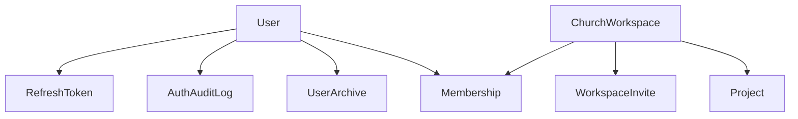
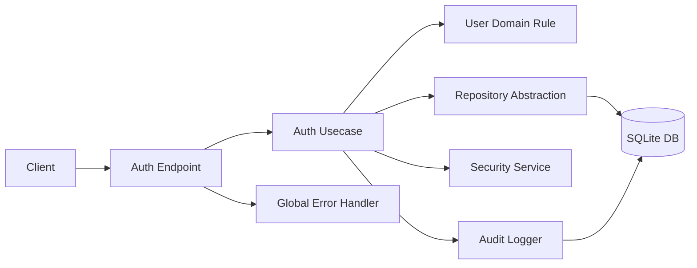
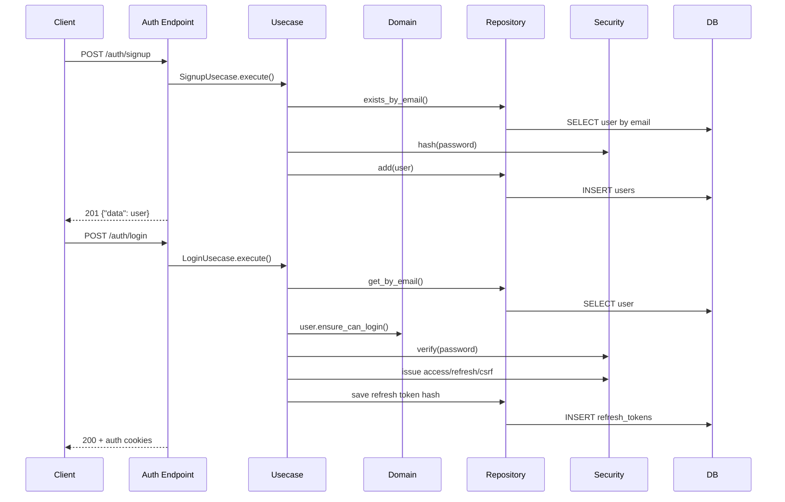
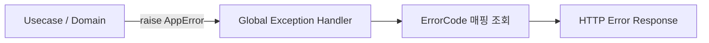
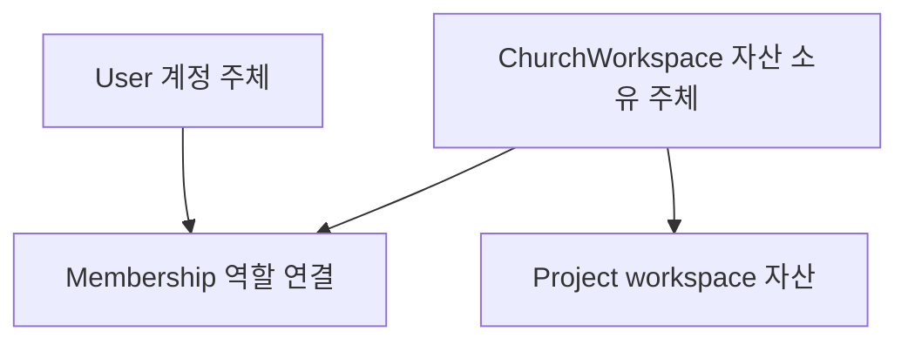

# Meeting Auth Architecture Explained

> 회의에서 `회원가입/로그인 아키텍처`를 설명할 때 바로 보는 문서다.  
> 핵심은 `무엇을 정했는지`보다 `왜 그렇게 정했는지`, `다른 방식보다 왜 그게 맞는지`, `실제 코드에서 어디에 구현됐는지`를 빠르게 보여주는 것이다.

---

## Data Architecture



### 핵심 메시지

- `User`는 계정 주체다.
- `ChurchWorkspace`는 협업 자산의 소유 주체다.
- `Project`는 개인이 아니라 `ChurchWorkspace` 소유다.
- `Membership`이 권한 판단 기준이다.
- auth 관련 이력은 `RefreshToken`, `AuthAuditLog`, `UserArchive`로 분리한다.

---

## Quick View

| 항목 | 결정 | 이유 |
|---|---|---|
| 레이어 흐름 | `endpoint -> usecase -> domain/repository -> database` | 규칙/저장/응답 책임 분리 |
| 트랜잭션 단위 | `usecase 1개 = 기본 transaction 1개` | 비즈니스 원자성 기준 |
| 에러 구조 | `AppError + ErrorCode + 전역 변환` | HTTP 규칙이 하위 레이어로 새지 않게 |
| 성공 응답 | `{"data": ...}` | 프론트/AI 구현 규칙 고정 |
| 세션 방식 | `HttpOnly cookie + refresh token` | 브라우저 서비스 기준 |
| refresh 정책 | `rotation + hash 저장 + reuse detection` | 탈취/재사용 위험 축소 |
| 자산 소유권 | `User`가 아니라 `ChurchWorkspace` 소유 | 교회 공동 자산이 개인 탈퇴와 분리돼야 함 |
| DB 정책 | `app id + UTC + soft delete + FK + 제약 적극 사용` | DB도 정합성 방어선이 되어야 함 |

---

## Architecture Map



### 핵심 메시지

- `endpoint`는 요청/응답만 다룬다.
- 실제 판단은 `usecase`에서 한다.
- 도메인 규칙은 `domain`에 둔다.
- 저장은 `repository` 뒤로 숨긴다.
- 에러는 전역에서 HTTP 응답으로 바꾼다.

---

## Auth Request Flow



---

## 1. 레이어 흐름

### 결정

```text
presentation -> usecase -> domain/repository -> database
```

### 왜 이렇게 했는가

- endpoint가 직접 DB를 만지면 요청 규칙과 저장 규칙이 한 파일에서 같이 자란다.
- 팀원이 달라도 같은 위치에 같은 책임을 넣게 하려면 흐름이 단순해야 한다.
- AI가 구현해도 일관되게 만들려면 진입 규칙이 하나여야 한다.

### 왜 다른 방식이 아닌가

| 대안 | 문제 |
|---|---|
| `endpoint -> repository` 직결 | 검증/권한/에러 규칙이 endpoint마다 흩어진다 |
| `service interface / impl` 과다 사용 | 구현이 하나뿐이면 설명 비용만 늘어난다 |

### 실제 코드

- endpoint: [auth/endpoint.py](/Users/oseongjin/Documents/Sungjin/church/dev/ws/ws-architecture/backend/app/domains/auth/endpoint.py)
- usecase: [auth/usecase.py](/Users/oseongjin/Documents/Sungjin/church/dev/ws/ws-architecture/backend/app/domains/auth/usecase.py)
- domain: [user/domain.py](/Users/oseongjin/Documents/Sungjin/church/dev/ws/ws-architecture/backend/app/domains/user/domain.py)
- repository: [user/repository.py](/Users/oseongjin/Documents/Sungjin/church/dev/ws/ws-architecture/backend/app/domains/user/repository.py)
- app 조립: [main.py](/Users/oseongjin/Documents/Sungjin/church/dev/ws/ws-architecture/backend/app/main.py)

### 회의용 한 줄

> 모든 비즈니스 요청은 endpoint에서 끝나지 않고 usecase를 거쳐 domain과 repository로 내려간다.

---

## 2. signup / login을 분리한 이유

### 결정

- `signup`은 계정 생성만 한다.
- `login`은 세션 발급만 한다.

### 왜 이렇게 했는가

- 계정 생성과 인증은 다른 행위다.
- `계정 생성`과 `세션 발급`을 분리해야 auth 아키텍처 설명이 선명해진다.

### 왜 다른 방식이 아닌가

| 대안 | 문제 |
|---|---|
| signup 후 자동 로그인 | 가입 실패/인증 실패/세션 발급 실패가 한 흐름에 묶인다 |
| signup에서 workspace까지 생성 | auth 경계가 흐려진다 |

### 실제 코드

- signup: [auth/usecase.py](/Users/oseongjin/Documents/Sungjin/church/dev/ws/ws-architecture/backend/app/domains/auth/usecase.py)
- login: [auth/usecase.py](/Users/oseongjin/Documents/Sungjin/church/dev/ws/ws-architecture/backend/app/domains/auth/usecase.py)
- 라우팅: [auth/endpoint.py](/Users/oseongjin/Documents/Sungjin/church/dev/ws/ws-architecture/backend/app/domains/auth/endpoint.py)

### 회의용 한 줄

> signup은 계정을 만들고, login은 세션을 만든다.

---

## 3. 트랜잭션 단위

### 결정

- 기본 기준은 `usecase 1개 = transaction 1개`
- 읽기 usecase는 기본적으로 transaction 없음
- 기준은 `같이 성공/실패해야 하는가`

### 왜 이렇게 했는가

- 트랜잭션은 DB 함수 단위가 아니라 비즈니스 원자성 단위여야 한다.
- 회원가입/로그인처럼 하나의 기능으로 설명되는 흐름을 기준으로 묶는 편이 설계 설명이 쉽다.

### 왜 다른 방식이 아닌가

| 대안 | 문제 |
|---|---|
| repository 메서드마다 transaction | 여러 저장이 하나의 비즈니스 흐름으로 묶이지 않는다 |
| 모든 조회도 transaction | 정합성보다 비용과 복잡도만 늘기 쉽다 |

### 실제 코드

- DB 연결/커밋 경계: [core/database.py](/Users/oseongjin/Documents/Sungjin/church/dev/ws/ws-architecture/backend/app/core/database.py)
- 대표 쓰기 흐름:
  - [auth/usecase.py](/Users/oseongjin/Documents/Sungjin/church/dev/ws/ws-architecture/backend/app/domains/auth/usecase.py)
  - [workspace/usecase.py](/Users/oseongjin/Documents/Sungjin/church/dev/ws/ws-architecture/backend/app/domains/workspace/usecase.py)
  - [project/usecase.py](/Users/oseongjin/Documents/Sungjin/church/dev/ws/ws-architecture/backend/app/domains/project/usecase.py)

### 회의용 한 줄

> 트랜잭션은 DB 함수 기준이 아니라 유스케이스 기준으로 본다.

---

## 4. 예외 / 에러 처리 구조

### 먼저 이 말의 뜻

```text
usecase/domain/repository에서는
"HTTP 401" 같은 웹 응답을 직접 만들지 않는다.

대신
"이건 AUTH_INVALID_CREDENTIALS다"
"이건 AUTH_EMAIL_ALREADY_EXISTS다"
처럼 실패 의미만 담긴 AppError를 던진다.

맨 바깥의 전역 처리기가
그 AppError를 보고 HTTP status와 message로 바꾼다.
```

### 흐름 그림



### 결정

```text
하위 레이어: AppError + ErrorCode
표현 레이어: 전역 예외 처리기에서 HTTP 응답 변환
```

### 왜 이렇게 했는가

- 비즈니스 로직이 `HTTPException`을 알게 두면 웹 프레임워크에 묶인다.
- status/message를 전역 매핑으로 두면 endpoint마다 응답이 달라지지 않는다.

### 왜 다른 방식이 아닌가

| 대안 | 문제 |
|---|---|
| endpoint마다 try/except | 같은 실패가 다른 status/message로 나가게 된다 |
| 예외 클래스 다수 | 실제 의미 차이가 `ErrorCode`와 중복된다 |

### 실제 코드

- 예외 타입: [exceptions.py](/Users/oseongjin/Documents/Sungjin/church/dev/ws/ws-architecture/backend/app/core/exceptions.py)
- 에러 코드: [error_codes.py](/Users/oseongjin/Documents/Sungjin/church/dev/ws/ws-architecture/backend/app/core/error_codes.py)
- 매핑: [error_mapping.py](/Users/oseongjin/Documents/Sungjin/church/dev/ws/ws-architecture/backend/app/core/error_mapping.py)
- 전역 처리기: [http.py](/Users/oseongjin/Documents/Sungjin/church/dev/ws/ws-architecture/backend/app/core/http.py)
- 실제로 AppError를 던지는 곳: [auth/usecase.py](/Users/oseongjin/Documents/Sungjin/church/dev/ws/ws-architecture/backend/app/domains/auth/usecase.py)

### 회의용 한 줄

> 에러는 하위에서 AppError로 통일하고, HTTP 응답으로 바꾸는 책임은 전역 처리기에 둔다.

---

## 5. 응답 계약

### 결정

- 성공: `{"data": ...}`
- 실패: `{"error": {"code", "message", "request_id"}}`
- validation: `errors[]` 배열

### 왜 이렇게 했는가

- 프론트와 백엔드가 endpoint마다 다른 형식을 외우지 않아도 된다.
- AI가 코드를 생성해도 응답 규칙을 반복적으로 맞출 수 있다.

### 왜 다른 방식이 아닌가

| 대안 | 문제 |
|---|---|
| API마다 응답 형식 다름 | 구현 규칙과 테스트 규칙이 분산된다 |
| validation을 문자열 하나로만 표현 | 프론트가 필드별 표시를 하기가 어렵다 |

### 실제 코드

- 공통 응답 생성: [core/http.py](/Users/oseongjin/Documents/Sungjin/church/dev/ws/ws-architecture/backend/app/core/http.py)
- auth 응답 모델: [auth/schema.py](/Users/oseongjin/Documents/Sungjin/church/dev/ws/ws-architecture/backend/app/domains/auth/schema.py)
- workspace 응답 모델: [workspace/schema.py](/Users/oseongjin/Documents/Sungjin/church/dev/ws/ws-architecture/backend/app/domains/workspace/schema.py)
- project 응답 모델: [project/schema.py](/Users/oseongjin/Documents/Sungjin/church/dev/ws/ws-architecture/backend/app/domains/project/schema.py)

### 회의용 한 줄

> 응답 형식은 성공이면 data, 실패면 error로 고정했다.

---

## 6. 인증 정책

### 결정

- 초기 auth 범위: `signup / login / refresh / logout / me / withdraw`
- 세션 방식: `HttpOnly cookie + refresh token`
- `refresh`는 access 만료 후 기본 경로
- refresh token: `rotation + hash 저장 + reuse detection`
- logout: `현재 refresh revoke + 쿠키 삭제`

### 왜 이렇게 했는가

- 브라우저 서비스에서는 cookie 기반 흐름이 자연스럽다.
- refresh rotation과 hash 저장은 최소한의 세션 안전선이다.
- logout을 쿠키 삭제만으로 보면 서버 세션 의미가 약해진다.

### 왜 다른 방식이 아닌가

| 대안 | 문제 |
|---|---|
| localStorage bearer token | 브라우저 보안 조합을 더 많이 관리해야 한다 |
| refresh token 원문 저장 | DB 유출 시 위험하다 |
| reuse detection 없이 재사용 허용 | 탈취 세션이 남을 수 있다 |

### 실제 코드

- 보안 로직: [core/security.py](/Users/oseongjin/Documents/Sungjin/church/dev/ws/ws-architecture/backend/app/core/security.py)
- auth 흐름: [auth/usecase.py](/Users/oseongjin/Documents/Sungjin/church/dev/ws/ws-architecture/backend/app/domains/auth/usecase.py)
- 쿠키: [auth/cookies.py](/Users/oseongjin/Documents/Sungjin/church/dev/ws/ws-architecture/backend/app/domains/auth/cookies.py)
- refresh 저장소: [auth/repository.py](/Users/oseongjin/Documents/Sungjin/church/dev/ws/ws-architecture/backend/app/domains/auth/repository.py)

### 회의용 한 줄

> 브라우저 기준으로 cookie 세션을 쓰되, refresh rotation과 revoke로 세션 안전성을 확보했다.

---

## 7. DB 정책

### 결정 체크리스트

- [x] 식별자는 애플리케이션에서 생성
- [x] 시간은 UTC 저장
- [x] soft delete 기본
- [x] 핵심 참조 관계는 FK
- [x] DB 제약을 마지막 방어선으로 사용

### 왜 이렇게 했는가

- 저장 전에도 객체의 정체성을 설명할 수 있어야 한다.
- 시간 저장과 표시 기준을 분리해야 운영이 덜 꼬인다.
- 애플리케이션 검증만으로는 중복/무결성 오류를 완전히 막기 어렵다.

### 왜 다른 방식이 아닌가

| 대안 | 문제 |
|---|---|
| DB insert 시 ID 생성만 사용 | 저장 전 객체 흐름 설명이 약해진다 |
| 로컬 시간 저장 | 환경이 늘어나면 시간 해석이 꼬인다 |
| 제약을 앱에만 둠 | 정합성 방어선이 한 겹 줄어든다 |

### 실제 코드

- DB 스키마/초기화: [core/database.py](/Users/oseongjin/Documents/Sungjin/church/dev/ws/ws-architecture/backend/app/core/database.py)
- SQLite 저장소:
  - [user/repository.py](/Users/oseongjin/Documents/Sungjin/church/dev/ws/ws-architecture/backend/app/domains/user/repository.py)
  - [auth/repository.py](/Users/oseongjin/Documents/Sungjin/church/dev/ws/ws-architecture/backend/app/domains/auth/repository.py)
  - [audit/repository.py](/Users/oseongjin/Documents/Sungjin/church/dev/ws/ws-architecture/backend/app/domains/audit/repository.py)
  - [workspace/repository.py](/Users/oseongjin/Documents/Sungjin/church/dev/ws/ws-architecture/backend/app/domains/workspace/repository.py)
  - [project/repository.py](/Users/oseongjin/Documents/Sungjin/church/dev/ws/ws-architecture/backend/app/domains/project/repository.py)

### 회의용 한 줄

> DB는 단순 저장소가 아니라 마지막 정합성 방어선으로 사용한다.

---

## 8. 코드 작성 규칙

### 결정 체크리스트

- [x] 비즈니스 API는 기본적으로 usecase를 거친다
- [x] repository 추상화에 의존한다
- [x] endpoint는 입력/출력만 다룬다
- [x] Domain Service는 정말 관계 조율일 때만 쓴다

### 왜 이렇게 했는가

- 코드가 커져도 어디에 무엇을 넣을지 기준이 남는다.
- 팀원이 달라도 같은 책임 분리가 가능하다.

### 왜 다른 방식이 아닌가

| 대안 | 문제 |
|---|---|
| controller에 판단 로직 누적 | 계층 경계가 무너진다 |
| 구현 하나인데 인터페이스 과다 분리 | 구조 설명 비용만 커진다 |

### 실제 코드

- endpoint:
  - [auth/endpoint.py](/Users/oseongjin/Documents/Sungjin/church/dev/ws/ws-architecture/backend/app/domains/auth/endpoint.py)
  - [workspace/endpoint.py](/Users/oseongjin/Documents/Sungjin/church/dev/ws/ws-architecture/backend/app/domains/workspace/endpoint.py)
  - [project/endpoint.py](/Users/oseongjin/Documents/Sungjin/church/dev/ws/ws-architecture/backend/app/domains/project/endpoint.py)
- usecase:
  - [auth/usecase.py](/Users/oseongjin/Documents/Sungjin/church/dev/ws/ws-architecture/backend/app/domains/auth/usecase.py)
  - [workspace/usecase.py](/Users/oseongjin/Documents/Sungjin/church/dev/ws/ws-architecture/backend/app/domains/workspace/usecase.py)
  - [project/usecase.py](/Users/oseongjin/Documents/Sungjin/church/dev/ws/ws-architecture/backend/app/domains/project/usecase.py)

### 회의용 한 줄

> endpoint는 얇게 두고, 실제 판단과 흐름은 usecase와 domain에 둔다.

---

## 9. 교회 서비스 특성에 맞춘 소유권 모델



### 결정

- `User`는 계정 주체
- `ChurchWorkspace`가 실제 협업 자산 소유자
- `Membership(role)`이 권한 판단 기준
- `Project`는 개인이 아니라 workspace 소유

### 왜 이렇게 했는가

- 이 서비스는 개인 메모 앱이 아니라 교회 예배를 위한 공동 작업 서비스다.
- 개인이 떠나도 프로젝트와 교회 자산은 남아야 한다.

### 왜 다른 방식이 아닌가

| 대안 | 문제 |
|---|---|
| `User` 소유 | 담당자가 바뀔 때마다 이관 문제가 생긴다 |
| 프로젝트별 초대 중심 | 교회 단위 협업 모델이 약해진다 |

### 실제 코드

- workspace 흐름: [workspace/usecase.py](/Users/oseongjin/Documents/Sungjin/church/dev/ws/ws-architecture/backend/app/domains/workspace/usecase.py)
- project 흐름: [project/usecase.py](/Users/oseongjin/Documents/Sungjin/church/dev/ws/ws-architecture/backend/app/domains/project/usecase.py)

### 회의용 한 줄

> 개인은 계정 주체이고, 실제 자산 소유자는 ChurchWorkspace다.

---

## 10. 지금 구현된 범위

### Auth

- [auth/endpoint.py](/Users/oseongjin/Documents/Sungjin/church/dev/ws/ws-architecture/backend/app/domains/auth/endpoint.py)
- [user/endpoint.py](/Users/oseongjin/Documents/Sungjin/church/dev/ws/ws-architecture/backend/app/domains/user/endpoint.py)

### Workspace

- [workspace/endpoint.py](/Users/oseongjin/Documents/Sungjin/church/dev/ws/ws-architecture/backend/app/domains/workspace/endpoint.py)

### Project

- [project/endpoint.py](/Users/oseongjin/Documents/Sungjin/church/dev/ws/ws-architecture/backend/app/domains/project/endpoint.py)

---

## 회의에서 설명하는 순서

- [ ] 왜 auth를 첫 예시 도메인으로 잡았는가
- [ ] 전체 레이어 흐름을 어떻게 고정했는가
- [ ] 트랜잭션을 왜 usecase 기준으로 보는가
- [ ] 에러/응답 구조를 왜 이렇게 통일했는가
- [ ] cookie + refresh 정책을 왜 선택했는가
- [ ] 왜 User 소유가 아니라 Workspace 소유인가
- [ ] 이 결정이 실제 코드에서 어디까지 구현됐는가
