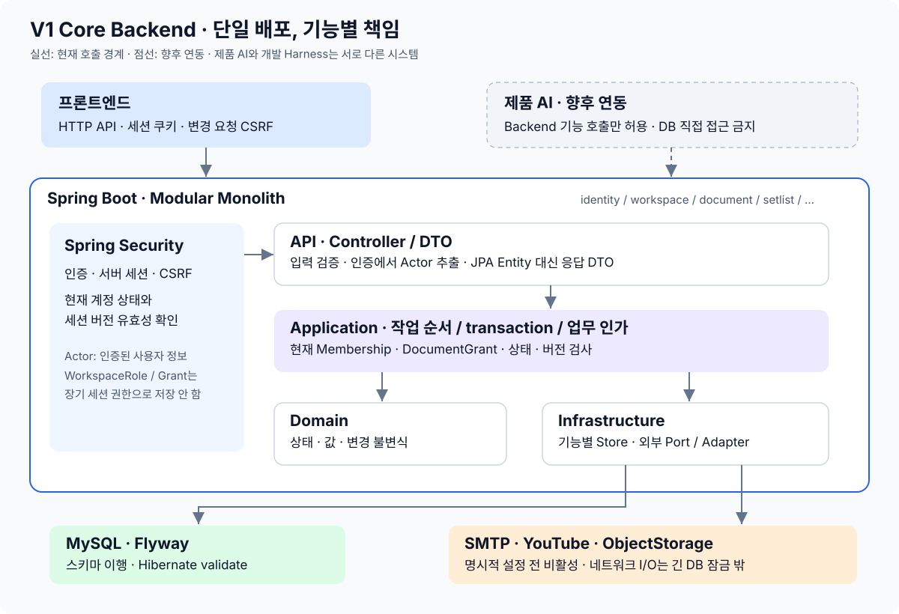
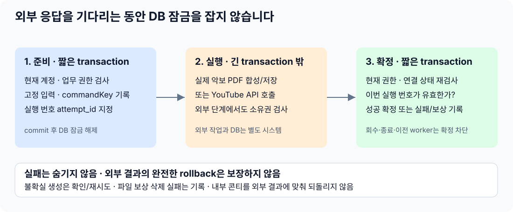
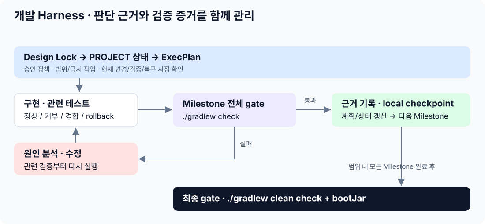

# 2. 개발자가 이해하는 구현 구조와 개발 방법

2026-10-07 · 서비스 행동은 [1. 사용 흐름](service-flows.md), 전체 컬럼은 [3. DB 구조](schema.md), 단계별 권한은 [4. 인증·권한](auth-flows.md)에 분리합니다.

아래는 현재 구현 설명입니다. 단일 ADMIN/이전·확인 후 MANAGER 승계·다수 구성원 종료는 승인된 [권한 정책](user_authorization_policy.md)에 따라 구현·회귀 검증했습니다. 프론트·AI 연결과 운영 준비의 완료를 뜻하지는 않습니다.

## 한눈에 보는 전체 구조

**Modular Monolith**는 기능별로 코드를 나누되 서버 하나로 배포하는 방식입니다. 마이크로서비스처럼 기능마다 별도 서버를 운영하지 않습니다. 관련 변경을 한 DB transaction으로 처리하기 쉽고 V1에서 배포 복잡성을 늘리지 않는 선택입니다.

이 도식은 책임 구분입니다. 실제로 모든 Domain 객체가 Infrastructure를 호출한다는 뜻은 아닙니다. 현재 기능 사이 Store 참조가 있어 엄격히 독립된 모듈 구조까지 보장하지는 않습니다.

## 어떤 기술을 어디에 쓰나요?

| 기술/방법 | 맡은 일 | 이유 |
|---|---|---|
| Java / Spring Boot | 단일 Backend 애플리케이션 | HTTP, 설정, transaction, 보안 기반을 함께 제공 |
| Spring Security + JDBC Session | 인증·세션·CSRF·Google 로그인 기반 | 업무 코드에 인증 프레임워크를 섞지 않음 |
| JPA 및 기능별 Store | 업무 데이터 읽기/변경. 일부 기술 데이터는 JDBC 사용 | DB 접근을 기능별로 모음 |
| MySQL | 계정·공간·문서·실행 기록 저장 | FK·UNIQUE·CHECK와 transaction으로 잘못된 연결/상태도 방어 |
| Flyway V1–V16 | DB 구조를 순서대로 변경 | 기존 DB가 어떤 변경을 거쳤는지 추적 |
| Hibernate validate | DB 구조와 매핑 일치 확인 | 운영 시작 시 임의 테이블 생성/변경 금지 |
| PDFBox | 한글 안내·송폼과 실제 악보 PDF/PNG/JPEG 합성 | 곡 순서·전체 PDF 페이지·회전·상속 리소스 유지. 최종 UI 승인과는 별도 |
| OpenAPI + record DTO | 프론트가 사용하는 요청·응답 계약 | JPA 내부 객체나 credential을 그대로 응답하지 않음 |

정확한 의존성 버전은 [build.gradle](../../../build.gradle)에 있습니다. 파일 원본은 DB가 아니라 ObjectStorage 뒤 저장소에 두고 DB에는 파일 메타데이터/저장 키를 둡니다.

## 코드 찾는 법 — 기능별 패키지

루트: `src/main/java/com/worship/core`

| 경로 | 책임 |
|---|---|
| `workspace/api/` | Controller의 HTTP 입력·응답 |
| `workspace/application/` | 작업 순서·권한·transaction |
| `workspace/domain/` | Membership 등의 상태와 규칙 |
| `workspace/infrastructure/` | 기능별 DB Store |
| `identity`, `document`, `setlist`, `song`, `score`, `reference`, `export`, `audit` | 같은 기준으로 나눈 업무 기능 |
| `integration`, `shared` | 외부 구현 / Actor·공통 오류·설정의 최소 공통 부분 |

| 기능 | 현재 책임 |
|---|---|
| identity | 가입·이메일·비밀번호·Google 신원·세션 무효화·회원탈퇴 |
| workspace | 공간·구성원·초대·단일 ADMIN 이전·종료·서비스 내 본인 알림 |
| document | 문서 공개 범위·문서 권한·마지막 MANAGER·공통 수정 버전 |
| setlist | 콘티 내용·곡 항목·순서·설정·송폼 |
| song / score / reference | 공간에서 재사용할 곡·업로드 악보·참고 링크, 검색 경계 |
| export | 특정 저장본 고정·PDF 생성·재시도·다운로드 |
| integration | 별도 YouTube 권한·Playlist 작업·외부 adapter·파일 저장소 |
| audit | 필요한 보안/책임 변경 기록. 관리 화면/전체 행동 분석 시스템은 아님 |

모든 기능에 같은 수의 파일을 만들지는 않습니다. 공통 controller/service/repository 폴더에 전체 기능을 몰아넣지 않습니다.

## 데이터 모델은 왜 이렇게 나눴나요?

| 나눈 것 | 실제 사례와 이유 |
|---|---|
| User / 이메일 / 로그인 수단 | 이메일을 바꿔도 같은 사용자다. 비밀번호와 Google 로그인도 독립적으로 관리 |
| User / Workspace / Membership | 민지는 A 공간 ADMIN, B 공간 MEMBER일 수 있다. 종료·재가입도 이력으로 구분 |
| 공간 Role / 문서 Role | 구성원 초대 권한이 비공개 콘티 읽기 권한으로 자동 이어지지 않음 |
| Document / Setlist | 권한·공개 범위·버전은 문서, 콘티 내용은 본문. 현재 문서 유형은 SETLIST 하나 |
| Song / SetlistItem | 같은 곡을 주일엔 G Key, 수요일엔 A Key로 사용. 사용 설정은 항목에 저장 |
| Score / Reference / 항목 선택 | 자료는 공간 안에서 재사용하고 어느 콘티에서 쓸지는 항목에 연결 |
| Google 신원 / YouTube 권한 | 서비스 로그인과 사용자 YouTube 계정의 Playlist 변경 권한은 다름 |
| 작업 명령 / 결과물 | 재시도 기록과 고정된 입력을 보존해 중복 실행·과거 파일 변경 방지 |

이 개념·관계·규칙 묶음이 여기서 말하는 **온톨로지**입니다. 별도 그래프 DB나 추론 엔진이 아니라 테이블, 업무 권한, 상태 변경, 테스트에 적용한 도메인 모델입니다.

## 저장 흐름과 동시 수정 방지

예: 준호가 콘티 곡의 메모를 저장합니다.

저장 요청에는 `workspaceId`, `documentId`, `itemId`, `expectedVersion`과 변경 내용을 포함합니다. Application은 현재 EDIT 권한과 자원 범위를 검사한 뒤 버전을 비교합니다. 불일치하면 `409 VERSION_CONFLICT`, 일치하면 항목 변경과 문서 버전 증가를 한 transaction에서 확정합니다.

transaction은 관련 DB 변경을 모두 저장하거나 모두 취소하는 경계입니다. 콘티 항목과 Document 버전은 같은 경계에서 처리합니다. 별도 Setlist 수정 버전으로 이중 충돌 모델을 만들지 않습니다.

단일 ADMIN/마지막 MANAGER는 여러 행을 함께 봐야 하므로 짧은 transaction과 잠금으로 경쟁을 처리합니다. ADMIN 이전·확인 후 MANAGER 승계·종료에서 역할/문서 버전/소속/초대/Audit/알림의 관련 변경은 모두 commit되거나 모두 취소됩니다. verified 이메일·활성 Membership·두 번째 ACTIVE ADMIN은 DB UNIQUE도 함께 막습니다. 정확히 한 ADMIN/마지막 MANAGER 보장은 index나 CHECK 하나만으로 구현되지 않습니다.

종료 영향은 각 기능의 `WorkspaceTerminationParticipant`로 수집합니다. WorkspaceStore에 다른 기능 SQL을 몰아넣지 않으며 제목/내용 없이 수·현재 상태 지문만 반환합니다. 진행 중 표시는 DB에 기록된 RUNNING PDF/Playlist 범위입니다. 모든 네트워크 요청을 추적하는 큐나 작업 플랫폼은 추가하지 않았습니다.

2026-10-03 개선: 순수 조회는 계정→Workspace 순서로 공유 잠금을 잡고 응답 DTO를 만드는 동안 유지합니다. 조회끼리는 동시에 진행하며 권한 변경·탈퇴는 쓰기 잠금으로 순서를 보호합니다. 인증 검사에는 이메일·비밀번호·Google 연결 상세를 읽지 않습니다. OPEN 조회는 Grant 조회도 생략하지만 수정/관리는 반드시 검사합니다. 활성 소속은 기존 `workspace_id + active_user` UNIQUE 인덱스로 찾습니다.

PDF/Playlist 생성의 원문 조회는 일반 조회가 아니라 `getForCommand`를 사용해 처음부터 쓰기 잠금을 유지합니다. 공유 잠금을 잡았다가 쓰기로 올리는 경로를 정상 명령 흐름에 만들지 않습니다. 권한 검사와 DB 변경은 같은 transaction이며, 외부 호출 전/후의 짧은 transaction 구조는 유지합니다.

## 외부 요청은 왜 두 번 나눠 저장하나요?

외부 응답을 기다리며 DB 잠금을 계속 잡으면 다른 작업도 오래 기다립니다. DB와 외부 서비스는 한 번에 되돌릴 수 없으므로 상태 기록·재시도·보상으로 복구합니다.

| 장치 | 쉬운 뜻 | 실제 쓰임 |
|---|---|---|
| commandKey | 같은 작업의 재요청임을 알아보는 번호 | 같은 키/같은 작업이면 중복 생성을 피함. 다른 요청에 재사용하면 충돌 |
| sourceVersion | 어느 저장본을 사용할지 | 이미 수정된 문서의 이전 요청으로 새 결과물을 만들지 않음 |
| canonical_json | 생성 시점 내용을 고정해 둔 사본 | Export 실패 후 재시도도 같은 내용을 사용 |
| attempt_id | 이번 실행의 번호 | 늦게 끝난 이전 실행이 새 실행 결과를 덮지 못하게 함 |
| UNCERTAIN | 외부 생성 성공 여부를 아직 모름 | Playlist를 무작정 다시 만들지 않고 marker로 기존 생성 여부 확인 |
| compensation | 앞서 만든 외부 파일을 정리 | DB 저장 실패 후 파일 삭제, 삭제도 실패하면 별도 기록 |
| hash | 같은 내용인지 비교하는 지문 | PDF 저장 파일 손상 검사. 비밀값 암호화 기능과는 다름 |

Export의 성공 파일은 원문 수정 후에도 바뀌지 않습니다. 이 불변성은 Application 동작으로 보장하며 DB에서 모든 UPDATE를 금지하는 trigger는 없습니다. 현재 PDF 내용의 한계는 [사용 흐름 8단계](service-flows.md)에 표시했습니다.

## Harness — 어떻게 개발을 통제했나요?

- `AGENTS.md`: 범위·위험·금지 작업과 근거 우선순위.
- `PROJECT_DESIGN.md`: 제품/보안 규칙의 원본. 구현 편의를 위해 임의 변경하지 않음.
- `PROJECT.md`: 현재 상태와 사람의 결정이 필요한 항목.
- ExecPlan: 단계별 완료 근거, 실패·복구, 다음 시작점.
- 로컬 checkpoint: 검증된 작업을 되돌아볼 지점. 원격 게시·병합은 승인된 브랜치/범위에서만 수행하고 gate가 사람의 승인을 대신하지 않음.

이는 저장소의 개발 방법입니다. 제품의 AI Runtime이나 운영 중 사용자 승인 프로토콜을 구현한 것은 아닙니다. 테스트가 요구사항을 잘못 해석할 수도 있으므로 통과 여부뿐 아니라 **설계→구현→테스트 기대값**을 함께 점검합니다.

## 검증은 성공 경로만 있나요?

| 검증 종류 | 확인하는 예 |
|---|---|
| 정상 업무 | 가입→초대→콘티 구성→외부 재시도→PDF→책임 이전 |
| 거부 경로 | 다른 공간 ID, 비공개 문서 ADMIN 우회, 권한 없는 PDF 생성 |
| 생명주기 | 종료 소속 접근, 재가입 권한 복원 금지, 마지막 책임자 종료 거부 |
| 경쟁·부분 실패 | 두 사람의 동시 변경, 동시 탈퇴, 저장/외부 작업 중 실패 |
| 보안 입력 | 위조·만료·잘못된 발급자/수신자 OIDC 토큰, CSRF 누락 |
| DB 변경 | 새 DB 전체 migration, 기존 DB upgrade, 불법 행 때문에 변경 중단·복구 |
| 실제 DB 대조 | 26개 테이블·177개 컬럼·39 FK·27 CHECK 이름과 manifest 일치 |
| 권한 조회 효율·순서 | SQL 수, 동시 조회, 회수/종료/rollback과 대기 중 조회, 기존 활성 소속 인덱스 사용 |

최근 기록: **2026-10-07 clean check + bootJar 통과, 135 tests / 16 suites, 실패·오류·skip 0**(4m22s). 별도 빈 MySQL의 V16/validate 및 배포 JAR 시작도 확인했습니다. 증거는 [후속 ExecPlan](../../../.agent/plans/active/backend-v1-team-ready.md)에 기록합니다. 2026-10-03 조회 개선은 실제 문서 조회 SQL 8→5(RESTRICTED)/4(OPEN), 동시 조회와 조회300건+변경25건의 로컬 혼합 실행을 확인했습니다. 구체적 수치/전제는 [개선 ExecPlan](../../../.agent/plans/active/authorization-efficiency.md)에 있습니다. 격리 MySQL과 fake/가로챈 HTTP만 사용했으며 실제 운영 부하나 외부 서비스 성공을 증명하지 않습니다.

## 프론트·AI 개발자에게 전달할 경계

기존 사용자 미커밋 Java 변경 3개는 원래 bytes를 보존하고 현재 worktree 검증에 포함하되 checkpoint에는 넣지 않았습니다. 구조/스키마 최적화는 사용자와 논의한 다음 별도 작업합니다. 팀 공통 Harness·기능별 담당은 아직 실제 도구 설정/팀 계약을 받지 못한 제안입니다. `CLAUDE.md`나 경로 규칙의 자동 로딩·공통화가 이 저장소에 구현되었다고 주장하지 않습니다.

| 담당 | 사용할 것 | 아직 별도 확인할 것 |
|---|---|---|
| 프론트 | [OpenAPI](../../../src/main/resources/static/openapi.yaml), 세션/CSRF, 버전·명령 키·오류·상태 계약 | 클라이언트 생성·화면 연결·HTTPS/배포·실제 통합 |
| AI | Backend Application Capability와 동일한 업무 권한 | 인증 전달, tool 계약, 승인·대화·Runtime 설계/구현 |
| Backend | 데이터 저장·최종 인가·동시성·외부 adapter·악보 포함 PDF·확정 권한 정책 | 실제 provider 설정·운영 준비·논의 후 구조 최적화 |

AI가 승인받았다는 이유만으로 권한 없는 작업을 허용하지 않습니다. Actor를 클라이언트 입력으로 그대로 신뢰하는 경로도 만들지 않았습니다.

## 알려진 한계와 남은 결정

순수 조회의 account/workspace 쓰기 잠금과 불필요한 계정 상세 조회는 제거했습니다. 다만 공유 잠금도 변경 작업과 대기 관계가 있고, 변경은 여전히 Workspace 단위로 넓게 직렬화합니다. 로컬 합성 부하 검증을 운영 성능·최적 구조의 증명으로 확대하지 않습니다. 기능 간 Store 참조와 수명주기 callback 순환이 있으며 강제 모듈 의존성 검사는 없습니다.

실제 악보 포함 PDF는 구현·회귀·시각 확인을 수행했습니다. Reference는 새 등록/기존 선택으로 교체하고 공유 URL·제목 자체 편집은 제공하지 않습니다. 사용자 노출 기본값, 개인정보/이력 보존 정책, 실제 provider·배포·키관리·부하 검증은 [PROJECT](../../../PROJECT.md)에 남깁니다. 상세 실행 증거는 기존 ExecPlan에 기록하며 별도 점검 보고서는 유지하지 않습니다.

### 무엇을 유지하고 무엇을 개선할 수 있나요?

| 판단 | 이유 / 다음 행동 |
|---|---|
| 26개라는 수만으로 과설계 판정 불가 | 계정·소속·초대·문서·자료·외부 작업의 수명이 다릅니다. 각 테이블의 실제 쓰임은 DB 사전에 설명합니다. |
| Document–Setlist / User–Password 통합은 가능 | 분리가 기술적으로 필수라는 뜻은 아닙니다. 현재 API·인가·이행 비용 대비 이득이 확인되지 않아 유지하며, 구조 변경은 사용자 논의 뒤 적용합니다. |
| Setlist 조회 묶음·목록 페이지 처리 후보 | 항목별 자료 조회와 큰 응답 비용을 실제 규모로 측정한 뒤 결정합니다. 테이블 통합이나 Redis 도입이 선행 조건은 아닙니다. |
| 교차 Store·탈퇴 순환 의존 개선 후보 | 좁은 작업 계약과 호출 방향을 정리하되 여러 공간 탈퇴의 원자성·잠금 순서·tenant 방어를 보존해야 합니다. |
| 실패 기록의 운영 절차 필요 | cleanup 실패·UNCERTAIN·오래된 RUNNING을 누가 확인/재처리할지 정해야 합니다. 실패 기록이 있다는 것만으로 자동 복구 완료는 아닙니다. |

과거 점검에서는 PDF 생성 권한을 미명시 상태에서 READ로 해석하고 테스트도 그 값을 정답으로 삼은 잘못이 있었습니다. 사용자 결정으로 EDIT 생성/READ 다운로드로 바로잡았습니다. 파일명만 출력하는 PDF도 테스트 통과와 달리 실제 악보 포함 요구를 충족하지 못해 후속 구현했습니다. 따라서 **정책의 정당성·구현·테스트 실행·운영 승인**은 서로 다른 확인입니다. Harness의 비용/성능 점수나 독립 보안 감사 결과가 있는 것처럼 보고하지 않습니다.

## 팀에 전달할 협업 기준

현재는 Backend·프론트·AI 담당이 나뉘어 있고, 다른 두 담당의 코드·도구 설정·진척은 이 저장소만으로 확인할 수 없습니다. 기능별 담당과 공통 Harness는 아직 팀에 제안할 기준이지 적용 완료된 구조가 아닙니다.

| 맞출 것 | 필요한 자료 / 기준 |
|---|---|
| 첫 기능 통합 | 악보 포함 PDF를 예로 기능 책임자·협업자·리뷰자를 정하고 실제 화면에서 생성→다운로드·오류를 끝까지 확인 |
| 공통 계약 | OpenAPI 원본, ID/시간/오류, 세션/CSRF, 버전·명령 키. endpoint/route 문서에 같은 API를 다시 복제하지 않음 |
| 개발 도구 | 실제 규칙 파일·설정·버전을 받아 공통 정책/검증과 도구별 진입 안내를 맞춤. 파일이 있다는 것만으로 자동 로딩을 인정하지 않음 |
| 변경·리뷰 | 기능별 작업 브랜치, 권한/DB/API 변경의 관련 담당 리뷰, 적용된 migration 재작성 금지, 공통 gate와 실제 통합 완료 기준 |
| 제품 AI | 실제 사용자 인증 전달, capability 입출력, 승인·충돌·재시도 계약. 실행 승인은 Backend 인가를 대체하지 않고 AI는 DB에 직접 접근하지 않음 |
| 운영 | 실제 provider·HTTPS·키관리/회전·백업 복원·남용/자원 제한·실패 처리 담당·예산/예상 규모를 별도 확인 |

코딩 도구/모델 전면 통일이나 새 인프라 도입을 먼저 요구하지 않습니다. 실제 작업의 수정 횟수·완료 시간·검증 결과를 비교하고 필요한 공통화만 적용합니다. 자동 병합·새로고침 후 초안 복구·실시간 공동편집은 별도 후속 설계입니다.
