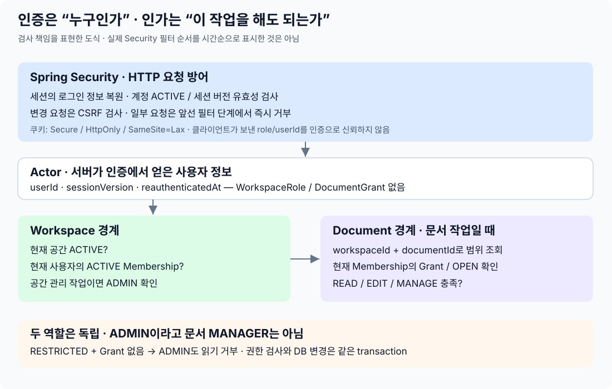
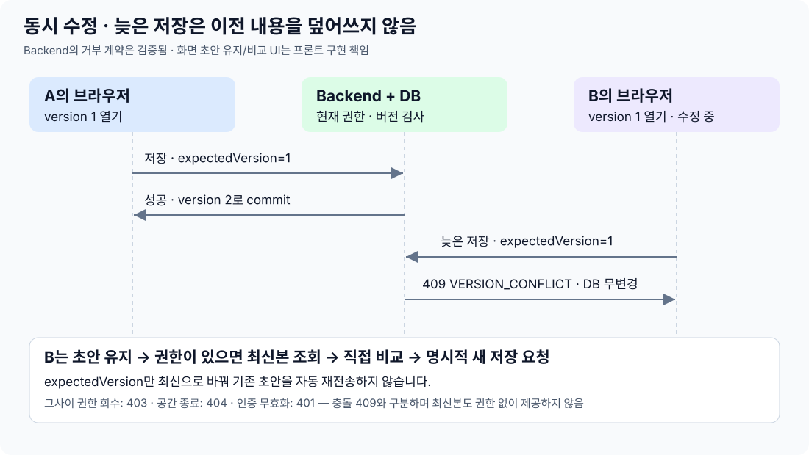

# 4. 사용자 행동을 따라 보는 인증과 권한

2026-10-07 · 각 단계의 검사, 구현 위치, 이유를 설명합니다. 전체 기능 설명은 [서비스 흐름](service-flows.md)에 있습니다.

정책 원본은 PROJECT_DESIGN.md, 상황별 결과는 [권한 참고서](user_authorization_policy.md), 최신 검증 완료 단계는 PROJECT에서 확인합니다. 이 문서는 현재 구현의 검사 순서와 이유를 설명합니다.

## 인증과 권한은 다른 질문입니다

| 질문 | 뜻 | 구현 |
|---|---|---|
| “누구세요?” | 인증: 계정의 주인임을 확인 | Spring Security, IdentityService, 서버 세션 |
| “여기서 이 작업을 해도 되나요?” | 인가: 공간 소속과 문서 권한 확인 | WorkspaceService, DocumentAuthorizationPolicy |
| “방금 본인이 확인했나요?” | 민감한 계정 변경을 위한 재인증 | Actor의 최근 확인 시각과 계정 검사 |

민지가 로그인했다고 해서 모든 공간과 문서를 볼 수 있는 것은 아닙니다. 화면에서 버튼을 숨기는 것은 안내일 뿐이며, 실제 허용 여부는 Backend에서 다시 판단합니다.

이 도식은 검사 책임을 설명합니다. 실제 Security 필터 실행 순서에서는 CSRF 등 앞선 검사에서 먼저 거부할 수도 있습니다.
Actor에는 `userId`, `sessionVersion`, `reauthenticatedAt`만 있고 공간·문서 Role은 없습니다. 클라이언트가 보내는 userId나 role을 인증으로 신뢰하지 않습니다.

## 1. 가입 → 이메일 확인

| 사용자 행동 | Backend 검사/저장 | 이렇게 하는 이유 |
|---|---|---|
| 이메일·비밀번호 가입 | 이메일 형식, 비밀번호 조건 검사. User와 이메일·비밀번호 해시 저장 | 이메일 주소가 계정의 영구 ID를 대신하지 않도록 분리 |
| 확인 링크 열기 | token_hash 조회 → 용도/만료/미사용/대상 검사 → verified 변경 | 링크를 재사용하거나 다른 이메일 확인에 쓰지 못하게 함 |
| 확인 경쟁 | 확인된 이메일의 단일 소유자 UNIQUE + transaction | 같은 주소를 두 계정이 동시에 소유한다고 확정하지 못하게 함 |
| 확인 메일 재요청 | 대상 검사 후 새 확인 절차 제공, 전달 상태 반환 | 만료·전송 실패를 가입 완료와 혼동하지 않음 |

비밀번호 원문은 저장하지 않고 Argon2id 해시로 비교합니다. 확인·재설정 링크의 비밀값도 원문 대신 해시를 저장합니다. 해시는 원문 비교를 위한 값이고, 복호화하는 암호화와는 다릅니다.

## 2. 로그인 → 브라우저에서 계속 사용

| 순서 | 요청/처리 | 다음 행동 |
|---|---|---|
| 1 | 프론트가 `GET /api/auth/csrf`로 헤더 이름과 값을 받음 | 로그인 요청에도 해당 CSRF 헤더 포함 |
| 2 | `POST /api/auth/login`의 대표·확인된 이메일/비밀번호/계정 상태 검사 | 인증 실패면 세션 인증을 만들지 않음 |
| 3 | `BrowserAuthentication.establish`가 세션 ID 교체·인증 저장·기존 CSRF 제거 | 로그인 전 세션 ID와 CSRF를 계속 쓰지 않음 |
| 4 | 프론트가 새 CSRF 값을 다시 받음 | 이후 변경 요청에 새 헤더 포함 |

| 장치 | 실제 방식 | 이유 |
|---|---|---|
| 서버 세션 | DB의 SPRING_SESSION/ATTRIBUTES에 로그인 정보 저장 | 브라우저가 권한 정보를 직접 소유하지 않게 함 |
| 세션 ID 변경 | 로그인·재인증 시 기존 ID 교체 | 로그인 전 알던 세션 ID로 로그인 후 계정을 가로채는 위험 감소 |
| 쿠키 | Secure, HttpOnly, SameSite=Lax | HTTPS 사용, 스크립트 접근 제한, 다른 사이트 요청 위험 감소 |
| CSRF | 세션과 연계된 확인값을 변경 요청 헤더로 받음 | 다른 사이트가 쿠키만 이용해 몰래 변경하는 요청 차단 |
| 세션 버전 | Actor의 값과 user_account.session_version 비교 | 비밀번호 재설정 등으로 이전 인증을 무효화 |

CSRF 검사는 로그인·가입처럼 로그인 전의 변경 요청에도 적용됩니다. 다운로드 GET은 변경 요청이 아니므로 CSRF 헤더가 필요하지 않지만, 로그인과 해당 자원 권한은 필요합니다. 쿠키가 Secure이므로 프론트 연동 환경도 HTTPS/프록시 구성을 확인해야 합니다.

현재 세션 시간·재인증 유효 시간 등 수치는 구현 기본값입니다. 변경할 수 없는 제품 정책으로 새로 확정한 것이 아닙니다.

## 3. Google 로그인·계정 연결

| 과정 | 확인하는 것 | 이유 |
|---|---|---|
| Google 로그인 시작/돌아오기 | 요청 state·nonce, 서명·issuer·audience·만료, 일회용 intent | 다른 로그인 요청이나 위조 토큰이 섞이지 않게 함 |
| Google 신원 찾기 | external_identity의 issuer + subject | 이메일은 바뀔 수 있어 Google의 안정적 신원 번호 사용 |
| 이메일이 기존 계정과 같음 | 자동 연결하지 않고 명시적 연결 요구 | 주소 일치만으로 계정을 탈취·병합하지 못하게 함 |
| 이미 로그인한 계정에 연결 | 해당 계정/세션에 묶인 LINK intent와 최근 본인 확인 | 로그인과 기존 계정 연결을 다른 행동으로 취급 |
| Google로 재인증 | REAUTHENTICATE intent와 현재 계정 신원 일치 | 다른 Google 계정 로그인으로 본인 확인을 대신하지 못하게 함 |

intent는 “이번 로그인/연결 시도”를 기억하는 짧은 기록입니다. 사용자 승인 프로토콜이나 AI 실행 계획을 뜻하지 않습니다. 실제 Google 흐름은 Provider 설정이 있어야 활성화됩니다.

## 4. 공간 생성 → 초대 → 참여

| 행동 | 검사 | 구현 이유 |
|---|---|---|
| 공간 생성 | ACTIVE 계정과 확인된 이메일 | 계정만 만들고 소유권 확인 없이 공간을 생성하지 못하게 함 |
| 초대/재전송/취소 | ACTIVE 공간의 ACTIVE ADMIN. 외부 전송 후 응답 전에도 재검사 | 로그인만으로 아무 공간의 사람을 관리할 수 없음 |
| 초대 수락 | 로그인 계정에 초대 주소와 같은 verified 이메일, 유효한 초대 | 초대 링크 소지만으로 다른 사람이 구성원이 되지 못하게 함 |
| 수락 완료 | 새 ACTIVE MEMBER Membership 생성 | 초대 기록과 실제 소속을 구분 |
| 중복 수락/참여 | 현재 상태 + DB 활성 소속 UNIQUE | 같은 계정의 같은 공간 활성 소속이 중복되지 않게 함 |
| ADMIN 이전 | 현재 ADMIN, 같은 공간의 다른 ACTIVE MEMBER | 이전자의 MEMBER 전환과 대상 ADMIN 전환·Audit·알림을 함께 commit. Grant는 바꾸지 않음 |
| MEMBER 강제 제거 | 현재 ADMIN, 영향 수 확인 후 실행 시 다시 계산 | 필요한 문서만 ADMIN에게 MANAGER를 부여. 소속·버전·Audit·알림을 함께 commit/rollback |
| 공간 종료 | 현재 ADMIN, 현재 영향 지문, 공간 이름 일치 | 공간 상태·모든 소속·미수락 초대·알림을 함께 commit. 일반 leave 보호와 구분 |

공간 A의 ADMIN이 공간 B의 ADMIN인 것은 아닙니다. `workspaceId`마다 소속을 다시 찾습니다.

## 5. 문서 열기·수정·권한 관리

아래 표는 모두 **해당 공간의 ACTIVE 구성원**이라는 조건을 먼저 충족해야 합니다.

| 필요한 권한 | OPEN, Grant 없음 | RESTRICTED, Grant 없음 | VIEWER | EDITOR | MANAGER |
|---|---|---|---|---|---|
| READ: 보기·기존 PDF 다운로드 | 허용 | 거부 | 허용 | 허용 | 허용 |
| EDIT: 콘티 변경·PDF 생성·Playlist 실행 | 거부 | 거부 | 거부 | 허용 | 허용 |
| MANAGE: 공개 범위·문서 권한 관리 | 거부 | 거부 | 거부 | 거부 | 허용 |

문서 생성은 ACTIVE 구성원이 할 수 있고 생성자가 MANAGER가 됩니다. Workspace ADMIN도 위 표를 똑같이 따릅니다. 구성원을 관리할 책임과 문서 내용을 열람할 권한을 분리한 설계입니다.

예: 공간 ADMIN인 민지가 준호의 RESTRICTED 문서에 Grant가 없으면 조회를 거부합니다. 민지가 그 문서의 MANAGER Grant도 받았을 때만 문서 권한을 관리할 수 있습니다.

| 구현 장치 | 실제 확인 | 이유 |
|---|---|---|
| 자원 범위 조회 | workspace_id + document_id | 다른 공간의 ID를 넣어 접근하는 우회 방지 |
| 현재 Grant | 현재 membership_id로 조회 | 탈퇴 후 남은 옛 권한을 새 소속에 연결하지 않음 |
| 복합 FK | Grant의 공간+문서, 공간+Membership 각각 검사 | 서로 다른 공간의 문서와 구성원을 DB에서도 연결하지 못하게 함 |
| 요청마다 DB 권한 검사 | 현재 상태 읽기 | 열린 브라우저에 예전 ADMIN/EDITOR 권한을 고정하지 않음 |
| expectedVersion | 클라이언트가 본 document.version과 현재 값 비교 | 오래된 저장 요청으로 다른 사람의 수정 덮어쓰기 방지 |

버전 검사는 권한 검사를 대신하지 않습니다. 최신 버전을 알아도 EDIT 권한이 없으면 변경할 수 없습니다.

### 권한 변경과 요청이 동시에 오면?

순수 조회는 계정·공간에 공유 잠금을 잡아 조회끼리 함께 진행합니다. 변경은 쓰기 잠금을 잡아 검사와 저장을 같은 transaction에서 처리합니다. 현재 DB 설정은 READ COMMITTED이며, transaction만으로 모든 조회 시점이 고정되는 것은 아니므로 관련 잠금으로 순서를 보호합니다.

| 먼저 진행한 DB 작업 | 결과 |
|---|---|
| 권한 회수/소속 종료가 먼저 잠금을 잡음 | 조회가 기다렸다가 commit된 상태 확인 → 권한 없으면 거부 |
| 허용된 조회가 먼저 잠금을 잡음 | DB 조회 완료 후 변경 진행. 변경 commit 후 검사하는 요청은 새 권한 적용 |
| 권한 변경을 rollback | Grant·문서 버전·Audit 변경도 취소. 기다리던 조회는 이전 유효 권한 확인 |

버튼을 누른 시각이 아니라 DB에서 확정되는 순서가 기준입니다. 이미 전송 중인 응답이나 받은 파일을 회수하는 장치는 아닙니다. PDF/Playlist 생성처럼 내부에 조회가 있는 변경 작업은 일반 조회 경로를 쓰지 않고 처음부터 쓰기 잠금을 유지합니다.

## 6. 악보·참고자료·외부 결과물

| 작업 | 요구 권한 | 구현/이유 |
|---|---|---|
| 공간의 곡·악보·참고자료 등록/검색/조회, 악보 원본 다운로드 | 해당 공간 ACTIVE 구성원 | 공간에서 재사용하는 자료이므로 특정 문서 Grant와 분리 |
| 콘티에 자료 선택·교체·해제 | 해당 문서 EDIT | 공유 자료 등록과 문서 내용 변경은 별개 |
| YouTube 권한 연결 | 로그인 계정 + 그 계정에 묶인 OAuth 절차 | Google 로그인만으로 Playlist 권한을 얻지 않음 |
| Playlist 생성·반영 | 문서 EDIT + 현재 사용자의 YouTube 연결 | 문서 수정 권한과 외부 계정 작업 권한을 모두 검사 |
| PDF 생성·재시도 | 문서 EDIT | 최종 결과물을 만드는 행위는 수정과 같은 수준 |
| PDF 조회·다운로드 | 현재 문서 READ | 생성자가 아니어도 현재 볼 권한이 있으면 결과물 사용 가능 |

외부 작업을 기다리는 동안 DB transaction을 계속 열어두지 않습니다. Export는 생성 전과 성공 파일 확정 시 EDIT를 다시 확인하고, 다운로드는 저장소에서 읽기 전과 반환 전 READ를 확인합니다. Playlist는 외부 단계에서 현재 권한·연결·실행 시도 번호를 재검사합니다. 외부 호출 전체가 DB 변경처럼 원자적이라는 뜻은 아닙니다.

악보 원본도 저장소 읽기 전과 반환 전에 현재 계정·소속·공간 상태를 검사합니다. PDF에는 선택한 실제 악보 전체 페이지가 포함됩니다. Playlist는 마지막 외부 호출 뒤에도 현재 권한·연결·실행 번호를 검사한 같은 DB transaction에서 성공을 확정합니다. 종료 후에는 일반 성공 확정을 차단하지만 외부에 이미 반영된 작업의 완전한 취소를 보장하지 않습니다.

## 7. 민감한 계정 변경 → 로그아웃·탈퇴

| 행동 | 본인 확인/추가 검사 | 이유 |
|---|---|---|
| 대표 이메일 변경·이메일 제거, 비밀번호 추가/제거, Google 연결/해제 | 최근 재인증, 대상 소유권, 남은 로그인 수단 | 세션만 훔친 사람이 로그인 수단을 바꿔 계정을 차지하는 위험 감소 |
| 비밀번호 변경 | 기존 비밀번호 검사, 다른 세션 무효화 | 변경한 브라우저는 새 인증 정보로 유지, 다른 로그인 차단 |
| 비밀번호 재설정 | 유효한 일회용 재설정값, 여전히 대표/확인된 이메일인지 검사 | 이전에 받은 링크로 바뀐 계정을 건드리지 못하게 함 |
| 로그아웃 | CSRF가 있는 POST, 현재 세션 종료 | 공간 참여 기록까지 종료하지는 않음 |
| 공간 나가기 | ADMIN·유일 MANAGER는 먼저 책임 이전 | 활성 공간·문서의 관리 책임이 사라지지 않게 함 |
| 구성원 제거 | ADMIN 영향 확인 후 필요한 MANAGER 승계와 제거를 함께 처리 | 자발적 탈퇴와 다른 승인된 예외. 제한 문서 제목은 확인 전에 공개하지 않음 |
| 서비스 탈퇴 | 최근 재인증 + 모든 공간/문서 책임 검사 | 하나라도 책임이 남으면 일부 공간만 탈퇴시키지 않고 전체 거부 |

Membership을 종료하면 ENDED로 기록합니다. 재가입은 새 ID이며 옛 Grant를 복원하지 않습니다. 계정 탈퇴 시 로그인 자료는 제거하지만 업무 기록의 연결을 위해 WITHDRAWN 계정 행은 남깁니다. 이것이 모든 개인정보 보존 정책이 확정됐다는 뜻은 아닙니다.

### 종료 뒤 예외적으로 볼 수 있는 것

일반 자료·목록 요청은 종료 상태를 확인해 404로 거부합니다. 본인 계정의 종료 알림/최소 상태만 종료 당시 수신 Membership과 User를 연결해 허용합니다. 여기에는 문서 제목·공간 이름·구성원 정보가 없습니다. 과거에 먼저 나간 사람이나 무관한 사람에게는 이 예외도 없습니다. 알림 읽음 처리에도 본인 Session과 CSRF를 요구하며 알림 자체는 권한을 부여하지 않습니다.

## 실패를 프론트에서 어떻게 설명하나요?

### 두 사용자의 저장 충돌 — 프론트 인계 계약

| 순서 | Backend 결과 | 프론트가 해야 할 일 |
|---|---|---|
| A와 B가 version 1을 열고 A가 먼저 저장 | version 2로 저장 | B의 화면 입력을 자동 초기화하지 않음 |
| B가 version 1로 저장 | 409 VERSION_CONFLICT, DB 변경 없음 | B 초안을 유지. 권한이 있으면 최신본을 별도로 조회·비교 |
| B가 직접 비교해 합친 내용 저장 | 최신 version을 포함한 명시적 새 요청 | expectedVersion만 바꿔 기존 초안을 자동 재전송하지 않음 |
| 그사이 B의 Grant 회수/소속 종료 | 403, 종료 공간은 404. 최신본도 제공하지 않음 | 충돌과 구분하고 접근 종료 안내. 권한 없는 최신본을 재조회하지 않음 |
| 로그인 종료/무효화 | 401 | 재로그인 안내. DB에 저장되지 않은 초안의 처리 범위는 프론트 계약 |

실제 두 세션 HTTP 테스트는 위 응답·DB 무변경·명시적 재저장을 확인합니다. 화면 입력 보존과 두 창 UX는 프론트 코드가 없는 이 저장소에서 검증하지 않았습니다.

공동편집의 초안 보존·원본/내 수정/최신본 비교·충돌 선택 UX는 [V1 이후 검토 기록](../../../PROJECT_DESIGN.md#v1-이후-협업-편집--초안-보존과-충돌-해결-검토)에 있습니다. 현재 409를 반환하는 Backend가 프론트 초안 보존/병합까지 구현한 것은 아닙니다. 이전 검증 기록은 이후 미커밋 코드 변경의 통과 증거가 아닙니다.

| 응답 | 사용자에게 필요한 안내 |
|---|---|
| 401 | 로그인 상태가 없거나 더 이상 유효하지 않음 → 다시 로그인 |
| 403 | 권한 부족, CSRF 실패, 재인증 필요 등 → 응답 code로 구분 |
| 404 | 해당 범위에 자원이 없음 → 다른 공간 ID인지 등 확인. 모든 권한 실패를 404로 바꾸지는 않음 |
| 409 | 예전 버전 저장·책임자 종료·명령 키 재사용 등 충돌 → 원인에 맞게 해결 |
| 503 | 연동 미설정·저장 파일 무결성 실패 등 → 운영/연동 상태 확인 |

실패 응답에는 `{code, message}`를 사용합니다. 외부 작업은 HTTP 200이어도 결과 `status`가 실패/진행 중일 수 있어 확인해야 합니다.

구현 근거: [IdentityService](../../../src/main/java/com/worship/core/identity/application/IdentityService.java), [BrowserAuthentication](../../../src/main/java/com/worship/core/identity/infrastructure/BrowserAuthentication.java), [WorkspaceService](../../../src/main/java/com/worship/core/workspace/application/WorkspaceService.java), [DocumentAuthorizationPolicy](../../../src/main/java/com/worship/core/document/application/DocumentAuthorizationPolicy.java). 최신 검증/한계는 [PROJECT](../../../PROJECT.md)에 요약하고 실행 증거는 기존 ExecPlan에 기록합니다. 별도 감사 보고서를 추가로 읽을 필요는 없습니다.
