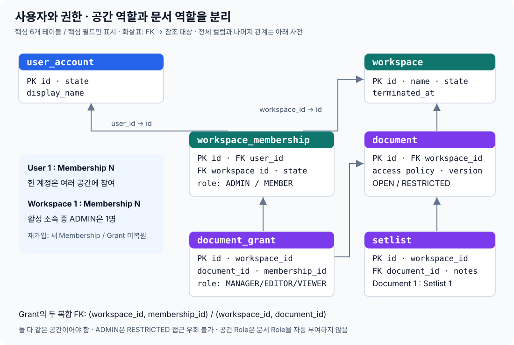

# 3. 테이블과 필드 — 의미, 사용 사례, 연결

2026-10-07 · Flyway V1–V16 기준 · 26개 테이블, 177개 필드. 사전처럼 필요한 테이블을 찾아보는 문서입니다. V13은 단일 ACTIVE ADMIN 제약, V14는 서비스 내 최소 알림 저장, V15는 표시 이름, V16은 공간 종료 상태입니다. 테스트용 manifest도 같은 V16 기준이며 실제 MySQL 스키마 대조를 통과했습니다.

관계부터 이해하려면 아래 삽입 도표를 먼저 보고, 필요한 테이블의 필드·참조 조합을 찾아보세요. 별도 관계도 페이지나 보는 법 문서는 유지하지 않으며 도표는 이 문서에 포함합니다.

## 읽는 방법

| 표기 | 쉬운 뜻 |
|---|---|
| PK / 기본 키 | 이 테이블의 한 행을 구분하는 값 |
| FK / 외래 키 | 다른 테이블의 실제 행에 연결하는 값. 잘못된 연결은 DB가 거부 |
| UNIQUE | 같은 값 또는 값 조합을 중복해서 저장할 수 없음 |
| CHECK | DB가 허용된 값·상태인지 검사. 모든 업무 규칙을 대신하지는 않음 |
| NULL 가능 | 아직 없거나 선택하지 않은 값으로 둘 수 있음 |
| 자동 생성 열 | 다른 필드에서 DB가 계산. 사용자가 입력하지 않음 |
| 복합 FK | 여러 필드를 함께 비교. 여기서는 공간 번호까지 같아야 연결 허용 |
| 논리 참조 | 번호로 이력을 연결하지만 DB FK는 없음. 대상 삭제 후 이력 유지 등에 사용 |

`bigint`는 정수 번호, `varchar(n)`은 길이 제한 문자열, `text/longtext`는 긴 내용, `tinyint(1)`은 참/거짓, `datetime(6)`은 UTC 시각, `blob`은 bytes입니다. Session 시간은 별도로 밀리초/초를 사용합니다. JSON은 구조화한 내용이고 별도 테이블이 아닙니다.

일반 `id`는 DB 증가 번호이며 Session 키와 password_credential은 예외입니다. 아래 ‘필드 연결’에서 각 줄은 실제 FK입니다. 일반 삭제는 대상이 참조 중이면 거부하고, Session attribute만 함께 삭제(CASCADE)합니다.

## 핵심 관계를 먼저 보기

도표의 화살표는 자식의 FK에서 참조 대상 방향입니다. Grant와 Setlist의 공간 자료 연결은 ID만이 아니라 workspace_id도 함께 검사합니다. User와 Workspace는 Membership을 통한 다대다이며 같은 사용자의 같은 공간 ACTIVE 소속은 최대 하나입니다. 이 도표는 핵심 6개 테이블의 관계 요약이고 전체 26개 테이블/177개 컬럼의 정의는 아래 사전에 있습니다.

### 예배가 바뀌면 무엇이 달라지나요?

| 행 | 예시 | 의미 |
|---|---|---|
| song | id=50, workspace_id=3, title=주 사랑 | 재사용 곡 정보 |
| setlist_item | song_id=50, setlist_id=100, musical_key=G, reference_id=60 | 주일 예배에서 쓰는 설정 |
| setlist_item | song_id=50, setlist_id=101, musical_key=A, reference_id=61 | 수요 예배에서 쓰는 설정 |
| song_reference | id=60 / id=61, workspace_id=3 | 영상 a / b. 곡과 직접 FK가 아니라 항목에서 선택 |

### Grant에 workspace_id가 왜 또 있나요?

| Grant 필드 조합 | 참조 대상 | DB가 확인하는 것 |
|---|---|---|
| `(workspace_id=3, document_id=80)` | `document(workspace_id=3, id=80)` | 문서가 공간 3에 속함 |
| `(workspace_id=3, membership_id=31)` | `workspace_membership(workspace_id=3, id=31)` | 소속도 같은 공간 3에 속함 |

Membership 31만 읽어도 공간을 알 수는 있습니다. 하지만 Grant에 공간을 함께 두면 문서와 구성원의 공간 불일치를 두 복합 FK로 DB가 직접 거부할 수 있습니다. 문서 권한은 user_id가 아니라 Membership에 붙어 종료·재가입을 구분합니다.

## 테이블 찾기

| 묶음 | 테이블 |
|---|---|
| 브라우저 세션 | SPRING_SESSION, SPRING_SESSION_ATTRIBUTES |
| 계정과 본인 확인 | user_account, user_email, password_credential, external_identity, account_token, oidc_intent |
| 공간과 참여 | workspace, workspace_membership, workspace_invitation, invitation_command |
| 본인 알림 | member_notice |
| 문서와 콘티 | document, document_grant, setlist, setlist_item |
| 재사용 자료 | song, score, song_reference |
| 외부 작업과 PDF | youtube_authorization, youtube_oauth_intent, playlist_command, immutable_export |
| 추적/정리 | audit_log, storage_cleanup_failure |

## 전체 필드 정의

### 01. `SPRING_SESSION` — 브라우저 로그인 상태

**언제 쓰나요?** 민지가 로그인한 브라우저의 세션을 유지하고 만료 시 종료합니다.

브라우저 쿠키의 SESSION_ID로 서버 세션을 찾습니다. PRINCIPAL_NAME은 계정 ID 문자열이지만 user_account와 DB FK로 연결하지 않습니다.

| 필드 | DB 타입 | 비워둘 수 있나요? | 의미와 실제 쓰임 |
|---|---|---|---|
| `PRIMARY_ID` | `char(36)` | 아니오 | 서버 내부 세션 행의 UUID 키. 세션 attribute가 이 값을 참조합니다. |
| `SESSION_ID` | `char(36)` | 아니오 | 브라우저 쿠키가 가리키는 세션 UUID. 로그인/재인증 시 교체합니다. |
| `CREATION_TIME` | `bigint` | 아니오 | 세션 생성 시각. 1970년부터 지난 밀리초로 저장합니다. |
| `LAST_ACCESS_TIME` | `bigint` | 아니오 | 마지막 세션 사용 시각(밀리초). 세션 만료 계산에 사용합니다. |
| `MAX_INACTIVE_INTERVAL` | `int` | 아니오 | 요청 없이 유지할 수 있는 시간(초). 이 시간이 지나면 세션을 만료시킵니다. |
| `EXPIRY_TIME` | `bigint` | 아니오 | 세션 만료 예정 시각(밀리초). 만료 판단/정리에 사용합니다. |
| `PRINCIPAL_NAME` | `varchar(100)` | 예 | 사용자 ID를 문자열로 보관한 세션 검색값. user_account로 향하는 FK는 아닙니다. |

**필드 연결**

DB FK 없음.

**중복 방지**: 기본 키 `PRIMARY_ID`; UNIQUE `SESSION_ID`.

### 02. `SPRING_SESSION_ATTRIBUTES` — 세션에 필요한 내부 값

**언제 쓰나요?** 로그인 정보, CSRF 값, OAuth 요청 정보를 세션에 보관합니다.

세션 삭제 시 연결된 attribute도 CASCADE로 삭제합니다. 공간/문서 역할을 장기 저장하는 권한 캐시가 아닙니다.

| 필드 | DB 타입 | 비워둘 수 있나요? | 의미와 실제 쓰임 |
|---|---|---|---|
| `SESSION_PRIMARY_ID` | `char(36)` | 아니오 | SPRING_SESSION.PRIMARY_ID를 참조하는 키. 어느 세션의 내부 값인지 연결합니다. |
| `ATTRIBUTE_NAME` | `varchar(200)` | 아니오 | 내부 값의 이름. 인증 정보·CSRF·OAuth 요청 등 값을 구분합니다. |
| `ATTRIBUTE_BYTES` | `blob` | 아니오 | 해당 값을 직렬화한 bytes. 서버가 세션 정보를 복원합니다. |

**필드 연결**

| 이 테이블의 필드 | 연결되는 테이블의 필드 |
|---|---|
| `SESSION_PRIMARY_ID` | `SPRING_SESSION.PRIMARY_ID` · 부모 세션 삭제 시 함께 삭제 |

**중복 방지**: 기본 키 `SESSION_PRIMARY_ID + ATTRIBUTE_NAME`.

### 03. `user_account` — 사용자 계정

**언제 쓰나요?** 이메일이나 로그인 방법이 바뀌어도 민지의 user ID는 유지됩니다.

state는 ACTIVE/WITHDRAWN. 탈퇴 후 업무 기록의 FK를 유지하기 위해 계정 행을 남깁니다. session_version 기본값은 0입니다.

V15의 `display_name`은 nullable varchar(80)이며 사용자가 본인 Profile에서 설정하는 공유 표시 이름입니다. 로그인 이메일이나 권한 식별자가 아니고 중복을 허용합니다. 이름 미설정 구성원은 ‘이름 미설정’으로 표시하며 이메일을 대신 노출하지 않습니다. 서비스 회원탈퇴 시 null로 지웁니다. 기존 이메일로 이름을 추정하여 채우지 않습니다.

| 필드 | DB 타입 | 비워둘 수 있나요? | 의미와 실제 쓰임 |
|---|---|---|---|
| `id` | `bigint` | 아니오 | 이 테이블의 한 행을 구분하는 번호. 다른 행이 참조하거나 API가 대상 선택에 사용합니다. |
| `state` | `varchar(20)` | 아니오 | ACTIVE는 사용 가능한 계정, WITHDRAWN은 탈퇴 기록. 요청/로그인에서 현재 계정 사용 가능 여부를 검사합니다. |
| `session_version` | `bigint` | 아니오 | 계정의 인증 무효화 번호. 현재 계정 값과 인증 당시 값이 다르면 예전 로그인으로 판단합니다. |
| `created_at` | `datetime(6)` | 아니오 | 생성 시각(UTC). 계정/공간/결과물이 언제 만들어졌는지 표시합니다. |
| `display_name` | `varchar(80)` | 예 | 본인 Profile에서 설정하는 공유 이름. 이메일/권한 식별자가 아니며 서비스 탈퇴 시 null 처리 |

**필드 연결**

DB FK 없음.

**중복 방지**: 기본 키 `id`.

DB CHECK 이름: `user_state`. 허용 상태/조건은 위 설명에 있습니다.

### 04. `user_email` — 계정의 이메일과 소유권

**언제 쓰나요?** 민지가 대표 주소와 추가 초대용 주소를 등록하고 확인합니다.

확인된 동일 이메일 소유자는 전체 서비스에서 최대 한 계정입니다. 대표 이메일은 한 계정에 최대 하나이며 비밀번호 로그인에는 확인된 대표 이메일을 씁니다.

| 필드 | DB 타입 | 비워둘 수 있나요? | 의미와 실제 쓰임 |
|---|---|---|---|
| `id` | `bigint` | 아니오 | 이 테이블의 한 행을 구분하는 번호. 다른 행이 참조하거나 API가 대상 선택에 사용합니다. |
| `user_id` | `bigint` | 아니오 | 연결된 사용자 계정 번호. user_account.id로 누구의 데이터인지 찾습니다. |
| `email` | `varchar(254)` | 아니오 | 이메일 주소. 형식을 정리해 저장하며 소유권 확인과 초대 대상 일치에 사용합니다. |
| `verified` | `tinyint(1)` | 아니오 | 이메일 소유권 확인 여부. 로그인/초대 수락의 이메일 조건에 사용합니다. |
| `primary_email` | `tinyint(1)` | 아니오 | 대표 이메일 여부. 확인된 대표 주소를 비밀번호 로그인 식별자로 사용합니다. |
| `verified_email` | `varchar(254)` | 예 · DB 자동 계산 | DB 자동 생성값: 확인됐으면 email, 아니면 NULL. 확인된 주소의 전체 단일 소유자를 UNIQUE로 강제합니다. |
| `primary_user` | `bigint` | 예 · DB 자동 계산 | DB 자동 생성값: 대표 이메일이면 user_id, 아니면 NULL. 계정당 대표 주소 최대 하나를 강제합니다. |

**필드 연결**

| 이 테이블의 필드 | 연결되는 테이블의 필드 |
|---|---|
| `user_id` | `user_account.id` |

**중복 방지**: 기본 키 `id`; UNIQUE `user_id + email`; UNIQUE `verified_email`; UNIQUE `primary_user`.

### 05. `password_credential` — 비밀번호 로그인 수단

**언제 쓰나요?** 이메일/비밀번호로 로그인하거나 Google-only 계정에 비밀번호를 추가합니다.

user_id가 PK이면서 FK라 계정당 최대 하나입니다. 원문 비밀번호는 저장하지 않습니다.

| 필드 | DB 타입 | 비워둘 수 있나요? | 의미와 실제 쓰임 |
|---|---|---|---|
| `user_id` | `bigint` | 아니오 | 연결된 사용자 계정 번호. user_account.id로 누구의 데이터인지 찾습니다. |
| `password_hash` | `varchar(255)` | 아니오 | Argon2id 비밀번호 해시. 로그인 입력과 비교하고 원문 비밀번호는 보관하지 않습니다. |

**필드 연결**

| 이 테이블의 필드 | 연결되는 테이블의 필드 |
|---|---|
| `user_id` | `user_account.id` |

**중복 방지**: 기본 키 `user_id`.

### 06. `external_identity` — Google 로그인 신원

**언제 쓰나요?** Google 로그인 사용자를 내부 계정과 연결합니다.

issuer+subject는 중복할 수 없습니다. 이메일 일치만으로 연결하지 않으며 YouTube API 권한과 별개입니다.

| 필드 | DB 타입 | 비워둘 수 있나요? | 의미와 실제 쓰임 |
|---|---|---|---|
| `id` | `bigint` | 아니오 | 이 테이블의 한 행을 구분하는 번호. 다른 행이 참조하거나 API가 대상 선택에 사용합니다. |
| `user_id` | `bigint` | 아니오 | 연결된 사용자 계정 번호. user_account.id로 누구의 데이터인지 찾습니다. |
| `issuer` | `varchar(255)` | 아니오 | Google 로그인 신원을 발급한 곳. subject와 합쳐 외부 계정을 안정적으로 식별합니다. |
| `subject` | `varchar(255)` | 아니오 | 발급자가 부여한 외부 계정의 고정 식별값. 이메일 주소 대신 신원 연결에 사용합니다. |

**필드 연결**

| 이 테이블의 필드 | 연결되는 테이블의 필드 |
|---|---|
| `user_id` | `user_account.id` |

**중복 방지**: 기본 키 `id`; UNIQUE `issuer + subject`.

### 07. `account_token` — 이메일 확인·비밀번호 재설정 기록

**언제 쓰나요?** 확인 링크를 눌렀을 때 대상과 만료, 이미 사용했는지 확인합니다.

kind는 VERIFY/RESET. token 원문 대신 해시를 저장합니다. email_id가 해당 user 소유인지, 용도·만료·사용 여부는 Application도 검사합니다.

| 필드 | DB 타입 | 비워둘 수 있나요? | 의미와 실제 쓰임 |
|---|---|---|---|
| `id` | `bigint` | 아니오 | 이 테이블의 한 행을 구분하는 번호. 다른 행이 참조하거나 API가 대상 선택에 사용합니다. |
| `user_id` | `bigint` | 아니오 | 연결된 사용자 계정 번호. user_account.id로 누구의 데이터인지 찾습니다. |
| `email_id` | `bigint` | 예 | 대상 user_email.id. 확인/재설정할 주소를 지정하며 용도에 따라 비어 있을 수 있습니다. |
| `kind` | `varchar(20)` | 아니오 | VERIFY는 이메일 확인, RESET은 비밀번호 재설정. 다른 용도로 token을 쓰지 못하게 합니다. |
| `token_hash` | `char(64)` | 아니오 | 링크에 담긴 비밀값의 SHA-256 해시. 받은 원문을 해시해 찾으며 원문은 DB에 저장하지 않습니다. |
| `expires_at` | `datetime(6)` | 아니오 | 사용 가능한 마지막 시각(UTC). 이후 링크/시도는 거부합니다. |
| `consumed` | `tinyint(1)` | 아니오 | 이미 사용했는지. 한 번 처리된 확인값/시도를 다시 사용하지 못하게 합니다. |

**필드 연결**

| 이 테이블의 필드 | 연결되는 테이블의 필드 |
|---|---|
| `user_id` | `user_account.id` |
| `email_id` | `user_email.id` |

**중복 방지**: 기본 키 `id`; UNIQUE `token_hash`.

DB CHECK 이름: `token_kind`. 허용 상태/조건은 위 설명에 있습니다.

### 08. `audit_log` — 보안·관리 책임 변경 이력

**언제 쓰나요?** 누가 어느 문서의 역할을 EDITOR에서 VIEWER로 바꿨는지 기록합니다.

이벤트와 업무 변경은 같은 transaction에서 저장합니다. V12 이전 행의 추가 맥락은 NULL 그대로 둡니다. API/관리 UI·위변조 방지 저장소·보존 기간은 별도입니다.

| 필드 | DB 타입 | 비워둘 수 있나요? | 의미와 실제 쓰임 |
|---|---|---|---|
| `id` | `bigint` | 아니오 | 이 테이블의 한 행을 구분하는 번호. 다른 행이 참조하거나 API가 대상 선택에 사용합니다. |
| `actor_id` | `bigint` | 아니오 | 사건이 귀속되는 계정. 가입/token 확인은 그 계정에 귀속되며 항상 로그인한 사람이 있다는 증명은 아닙니다. |
| `event` | `varchar(80)` | 아니오 | 보안/책임 변경의 종류. 초대·역할 변경·계정 연결 해제 등을 구분합니다. |
| `occurred_at` | `datetime(6)` | 아니오 | 일어난 시각(UTC). 이벤트 순서나 파일 정리 실패 시점을 확인합니다. |
| `workspace_id` | `bigint` | 예 | 영향받은 공간. 문서/소속 맥락이 있다면 필수이며 계정 자체 사건은 NULL일 수 있습니다. |
| `document_id` | `bigint` | 예 | 영향받은 문서. workspace_id와 함께 FK를 검사하며 계정 사건 등에서는 NULL입니다. |
| `membership_id` | `bigint` | 예 | 영향받은 참여 이력. 재가입 시 새 ID가 기록되고 계정/문서 단독 사건은 NULL일 수 있습니다. |
| `target_type` | `varchar(30)` | 예 | 대상 종류. EMAIL, MEMBERSHIP, DOCUMENT_GRANT 등 어느 테이블의 행인지 설명합니다. |
| `target_id` | `bigint` | 예 | 대상 행 번호. 삭제 가능한 이메일/credential/Grant의 이력도 남기므로 일부는 FK 없는 논리 참조입니다. |
| `change_field` | `varchar(20)` | 예 | 변경한 속성 이름. ROLE/STATE/ACCESS_POLICY 등 허용된 항목만 기록합니다. |
| `before_value` | `varchar(40)` | 예 | 변경 전 값. 고정 역할/상태/TRUE·FALSE만 기록하고 신규 생성 등은 NULL일 수 있습니다. |
| `after_value` | `varchar(40)` | 예 | 변경 후 값. 같은 허용값만 기록하며 삭제 의미에 따라 NULL/FALSE를 사용합니다. |

**필드 연결**

| 이 테이블의 필드 | 연결되는 테이블의 필드 |
|---|---|
| `actor_id` | `user_account.id` |
| `workspace_id` | `workspace.id` |
| `workspace_id + document_id` | `document.workspace_id + id` |
| `workspace_id + membership_id` | `workspace_membership.workspace_id + id` |

**중복 방지**: 기본 키 `id`.

DB CHECK 이름: `audit_context`, `audit_target`, `audit_change`. 허용 상태/조건은 위 설명에 있습니다.

### 09. `oidc_intent` — 한 번의 Google 인증 시도

**언제 쓰나요?** 이번 Google 응답이 로그인인지 연결인지 재인증인지 구분합니다.

mode는 LOGIN/LINK/REAUTHENTICATE. 로그인 전에는 대상 user가 없을 수 있고 연결·재인증은 현재 계정/세션에 묶습니다. 만료와 일회용 조건을 검사합니다.

| 필드 | DB 타입 | 비워둘 수 있나요? | 의미와 실제 쓰임 |
|---|---|---|---|
| `id` | `bigint` | 아니오 | 이 테이블의 한 행을 구분하는 번호. 다른 행이 참조하거나 API가 대상 선택에 사용합니다. |
| `state_hash` | `char(64)` | 아니오 | 외부 인증 요청을 구분하는 state 비밀값의 해시. 응답이 시작한 요청과 같은지 대조합니다. |
| `mode` | `varchar(20)` | 아니오 | Google 절차의 목적: LOGIN/ LINK/ REAUTHENTICATE. 각각 로그인·연결·재인증으로 처리합니다. |
| `user_id` | `bigint` | 예 | 연결/재인증 대상 계정. 로그인 시작은 계정이 정해지지 않아 NULL일 수 있습니다. |
| `session_version` | `bigint` | 예 | 시작 당시 계정의 세션 버전. 연결/재인증 응답이 여전히 유효한 세션에 속하는지 검사합니다. |
| `reauthenticated_at` | `datetime(6)` | 예 | 마지막 본인 확인 시각. 민감한 계정 작업의 최근 재인증 조건을 검사합니다. |
| `expires_at` | `datetime(6)` | 아니오 | 사용 가능한 마지막 시각(UTC). 이후 링크/시도는 거부합니다. |
| `consumed` | `tinyint(1)` | 아니오 | 이미 사용했는지. 한 번 처리된 확인값/시도를 다시 사용하지 못하게 합니다. |

**필드 연결**

| 이 테이블의 필드 | 연결되는 테이블의 필드 |
|---|---|
| `user_id` | `user_account.id` |

**중복 방지**: 기본 키 `id`; UNIQUE `state_hash`.

DB CHECK 이름: `intent_mode`. 허용 상태/조건은 위 설명에 있습니다.

### 10. `workspace` — 자료와 구성원의 작업 공간

**언제 쓰나요?** ‘은혜교회 찬양팀’ 공간을 생성합니다.

Workspace가 tenant, 즉 데이터 접근을 구분하는 경계입니다. 상위 교회/조직 계층이나 Owner 필드는 없습니다.

| 필드 | DB 타입 | 비워둘 수 있나요? | 의미와 실제 쓰임 |
|---|---|---|---|
| `id` | `bigint` | 아니오 | 이 테이블의 한 행을 구분하는 번호. 다른 행이 참조하거나 API가 대상 선택에 사용합니다. |
| `name` | `varchar(200)` | 아니오 | 공간 표시 이름. 사용자가 참여 공간 목록에서 고를 때 보여줍니다. |
| `created_at` | `datetime(6)` | 아니오 | 생성 시각(UTC). 계정/공간/결과물이 언제 만들어졌는지 표시합니다. |
| `state` | `varchar(10)` | 아니오 | ACTIVE는 이용 가능, TERMINATED는 종료. 모든 일반 자료 요청과 목록에서 현재 상태 확인 |
| `terminated_at` | `datetime(6)` | 예 | 종료 시각(UTC). ACTIVE에서는 NULL, TERMINATED에서는 필수. 본인 최소 종료 상태에 사용 |

**필드 연결**

DB FK 없음.

**중복 방지**: 기본 키 `id`.

### 11. `workspace_membership` — 공간 소속·역할·참여 이력

**언제 쓰나요?** 민지가 공간 A ADMIN, 공간 B MEMBER로 참여합니다.

role은 ADMIN/MEMBER, state는 ACTIVE/ENDED. ACTIVE의 end_reason은 NULL, ENDED는 종료 이유 필수(V11). 재가입은 새 ID입니다. V13은 ACTIVE ADMIN 최대 한 명을 DB에서 강제합니다. 생성/이전/일반 탈퇴의 Application transaction이 활성 공간에서 정확히 한 명을 유지합니다. 강제 제거는 확인 후 필요한 MANAGER 승계와 함께 처리하고 자발적 탈퇴는 책임 이전을 요구합니다. V16 공간 종료는 모든 ACTIVE 소속을 종료하는 별도 경로입니다.

| 필드 | DB 타입 | 비워둘 수 있나요? | 의미와 실제 쓰임 |
|---|---|---|---|
| `id` | `bigint` | 아니오 | 이 테이블의 한 행을 구분하는 번호. 다른 행이 참조하거나 API가 대상 선택에 사용합니다. |
| `workspace_id` | `bigint` | 아니오 | 이 자료가 속한 공간 번호. 다른 공간 자료가 섞이지 않도록 조회와 FK에 사용합니다. |
| `user_id` | `bigint` | 아니오 | 연결된 사용자 계정 번호. user_account.id로 누구의 데이터인지 찾습니다. |
| `role` | `varchar(10)` | 아니오 | 이 공간의 구성원 관리 역할: ADMIN/MEMBER. 문서 수정 권한과 별개입니다. |
| `state` | `varchar(10)` | 아니오 | ACTIVE는 현재 참여, ENDED는 종료 이력. 접근 검사에서 ACTIVE만 허용합니다. |
| `end_reason` | `varchar(20)` | 예 | 소속 종료 이유: LEFT(스스로 나감), REMOVED(제거됨), USER_WITHDRAWN(계정 탈퇴), WORKSPACE_TERMINATED(공간 종료). ACTIVE는 NULL입니다. |
| `active_user` | `bigint` | 예 · DB 자동 계산 | DB 자동 생성값: ACTIVE이면 user_id, ENDED면 NULL. 같은 공간·사용자의 활성 소속 최대 하나를 강제합니다. |
| `active_admin` | `bigint` | 예 · DB 자동 계산 | ACTIVE ADMIN이면 workspace_id, 나머지는 NULL. UNIQUE로 공간마다 ACTIVE ADMIN 최대 한 명을 강제합니다. 권한 역할을 추가하는 필드가 아닙니다. |

**필드 연결**

| 이 테이블의 필드 | 연결되는 테이블의 필드 |
|---|---|
| `workspace_id` | `workspace.id` |
| `user_id` | `user_account.id` |

**중복 방지**: 기본 키 `id`; UNIQUE `workspace_id + active_user`; UNIQUE `workspace_id + id`; UNIQUE `active_admin`.

ADMIN 이전은 이전 ADMIN의 역할을 먼저 MEMBER로 flush한 뒤 대상에게 ADMIN을 부여하지만, 모두 같은 transaction입니다. 외부 요청은 공간 잠금으로 중간 상태를 사용하지 못하며 실패 시 역할 변경도 rollback합니다. 기존 복수 ADMIN 행이 있으면 migration이 실패하며 임의로 사람을 고르지 않습니다.

DB CHECK 이름: `membership_role`, `membership_state`, `membership_end`. 허용 상태/조건은 위 설명에 있습니다.

### 12. `workspace_invitation` — 이메일로 보낸 공간 초대

**언제 쓰나요?** ADMIN이 준호에게 초대하고 준호가 이메일 소유권을 확인해 수락합니다.

state는 PENDING/ACCEPTED/EXPIRED/REVOKED. 초대 행만으로 구성원이 되지 않습니다. 수락 시 새 Membership을 생성합니다. delivery_status와 수락 상태는 다릅니다.

| 필드 | DB 타입 | 비워둘 수 있나요? | 의미와 실제 쓰임 |
|---|---|---|---|
| `id` | `bigint` | 아니오 | 이 테이블의 한 행을 구분하는 번호. 다른 행이 참조하거나 API가 대상 선택에 사용합니다. |
| `workspace_id` | `bigint` | 아니오 | 이 자료가 속한 공간 번호. 다른 공간 자료가 섞이지 않도록 조회와 FK에 사용합니다. |
| `inviter_id` | `bigint` | 아니오 | 초대한 user_account.id. 초대 발신자를 추적합니다. |
| `email` | `varchar(254)` | 아니오 | 이메일 주소. 형식을 정리해 저장하며 소유권 확인과 초대 대상 일치에 사용합니다. |
| `token_hash` | `char(64)` | 아니오 | 링크에 담긴 비밀값의 SHA-256 해시. 받은 원문을 해시해 찾으며 원문은 DB에 저장하지 않습니다. |
| `state` | `varchar(10)` | 아니오 | PENDING/ACCEPTED/EXPIRED/REVOKED. 수락·재전송·취소 가능 여부를 판단합니다. |
| `expires_at` | `datetime(6)` | 아니오 | 사용 가능한 마지막 시각(UTC). 이후 링크/시도는 거부합니다. |
| `delivery_status` | `varchar(30)` | 아니오 | 메일 전달 요청의 관찰 결과. 발송 실패/불확실 상태와 실제 초대 수락을 구분합니다. |

**필드 연결**

| 이 테이블의 필드 | 연결되는 테이블의 필드 |
|---|---|
| `workspace_id` | `workspace.id` |
| `inviter_id` | `user_account.id` |

**중복 방지**: 기본 키 `id`; UNIQUE `token_hash`; UNIQUE `workspace_id + id`.

DB CHECK 이름: `invitation_state`. 허용 상태/조건은 위 설명에 있습니다.

### 13. `invitation_command` — 초대 요청의 중복 방지

**언제 쓰나요?** 초대 버튼 요청이 재전송되어도 같은 명령인지 확인합니다.

공간+command_key를 중복할 수 없습니다. INVITE/RESEND는 Application이 검사합니다. 같은 키를 다른 내용/작업에 재사용하지 않습니다.

| 필드 | DB 타입 | 비워둘 수 있나요? | 의미와 실제 쓰임 |
|---|---|---|---|
| `id` | `bigint` | 아니오 | 이 테이블의 한 행을 구분하는 번호. 다른 행이 참조하거나 API가 대상 선택에 사용합니다. |
| `workspace_id` | `bigint` | 아니오 | 이 자료가 속한 공간 번호. 다른 공간 자료가 섞이지 않도록 조회와 FK에 사용합니다. |
| `invitation_id` | `bigint` | 아니오 | workspace_invitation.id. 재시도 명령이 어느 초대에 대한 것인지 찾습니다. |
| `actor_id` | `bigint` | 아니오 | 이 작업을 시작한 계정 번호. user_account.id로 행위 이력을 연결합니다. |
| `command_key` | `varchar(100)` | 아니오 | 같은 작업의 재요청을 식별하는 클라이언트 키. 공간 범위 UNIQUE로 중복 실행을 구분합니다. |
| `operation` | `varchar(10)` | 아니오 | INVITE 또는 RESEND. 첫 초대인지 재발송인지 구분합니다. |

**필드 연결**

| 이 테이블의 필드 | 연결되는 테이블의 필드 |
|---|---|
| `workspace_id` | `workspace.id` |
| `workspace_id + invitation_id` | `workspace_invitation.workspace_id + id` |
| `actor_id` | `user_account.id` |

**중복 방지**: 기본 키 `id`; UNIQUE `workspace_id + command_key`.

### 14. `document` — 문서의 공통 권한·수정 버전

**언제 쓰나요?** ‘주일 예배’ 콘티의 제목, 공개 범위, 저장 버전을 관리합니다.

V1 type은 SETLIST만. OPEN은 공간 구성원 조회 허용, RESTRICTED는 Grant 필요. version 기본 0이며 내용/권한 변경도 공통 버전을 사용합니다.

| 필드 | DB 타입 | 비워둘 수 있나요? | 의미와 실제 쓰임 |
|---|---|---|---|
| `id` | `bigint` | 아니오 | 이 테이블의 한 행을 구분하는 번호. 다른 행이 참조하거나 API가 대상 선택에 사용합니다. |
| `workspace_id` | `bigint` | 아니오 | 이 자료가 속한 공간 번호. 다른 공간 자료가 섞이지 않도록 조회와 FK에 사용합니다. |
| `title` | `varchar(200)` | 아니오 | 사람에게 표시하는 제목. 목록과 콘티/PDF 출력에서 사용합니다. |
| `type` | `varchar(20)` | 아니오 | V1은 SETLIST만 허용합니다. 해당 문서가 콘티 본문이라는 것을 구분합니다. |
| `access_policy` | `varchar(20)` | 아니오 | OPEN은 공간 구성원 조회, RESTRICTED는 Grant 필요. 인터넷 공개를 뜻하지 않습니다. |
| `version` | `bigint` | 아니오 | 공통 수정 번호. expectedVersion 비교 후 변경과 함께 증가시켜 오래된 저장 요청을 거부합니다. |
| `modified_at` | `datetime(6)` | 아니오 | 문서의 마지막 변경 시각(UTC). 버전 갱신과 함께 기록합니다. |

**필드 연결**

| 이 테이블의 필드 | 연결되는 테이블의 필드 |
|---|---|
| `workspace_id` | `workspace.id` |

**중복 방지**: 기본 키 `id`; UNIQUE `workspace_id + id`.

DB CHECK 이름: `document_type`, `document_access`. 허용 상태/조건은 위 설명에 있습니다.

### 15. `document_grant` — 소속에 부여한 문서별 역할

**언제 쓰나요?** 이번 문서에서 준호의 Membership을 EDITOR로 지정합니다.

role은 MANAGER/EDITOR/VIEWER. 같은 문서+Membership에 최대 하나입니다. 두 복합 FK로 문서와 구성원이 같은 공간인지 강제합니다. Workspace ADMIN에 자동 부여하지 않습니다.

| 필드 | DB 타입 | 비워둘 수 있나요? | 의미와 실제 쓰임 |
|---|---|---|---|
| `id` | `bigint` | 아니오 | 이 테이블의 한 행을 구분하는 번호. 다른 행이 참조하거나 API가 대상 선택에 사용합니다. |
| `workspace_id` | `bigint` | 아니오 | 이 자료가 속한 공간 번호. 다른 공간 자료가 섞이지 않도록 조회와 FK에 사용합니다. |
| `document_id` | `bigint` | 아니오 | 연결된 문서 번호. 해당 공간의 document.id를 찾아 권한/원본을 확인합니다. |
| `membership_id` | `bigint` | 아니오 | workspace_membership.id. 계정 자체가 아니라 이번 공간 참여 이력에 권한/사건을 연결합니다. |
| `role` | `varchar(20)` | 아니오 | 이 문서의 역할: MANAGER(보기·수정·권한관리), EDITOR(보기·수정), VIEWER(보기). |

**필드 연결**

| 이 테이블의 필드 | 연결되는 테이블의 필드 |
|---|---|
| `workspace_id + document_id` | `document.workspace_id + id` |
| `workspace_id + membership_id` | `workspace_membership.workspace_id + id` |

**중복 방지**: 기본 키 `id`; UNIQUE `document_id + membership_id`.

DB CHECK 이름: `grant_role`. 허용 상태/조건은 위 설명에 있습니다.

### 16. `setlist` — 콘티 본문

**언제 쓰나요?** 문서와 함께 생성하고 전체 메모·곡 항목을 보관합니다.

Document 생성 transaction에서 본문도 만듭니다. DB UNIQUE는 문서당 본문 최대 하나를 보장하며, 모든 문서에 본문이 반드시 존재한다는 규칙은 생성 흐름이 보장합니다.

| 필드 | DB 타입 | 비워둘 수 있나요? | 의미와 실제 쓰임 |
|---|---|---|---|
| `id` | `bigint` | 아니오 | 이 테이블의 한 행을 구분하는 번호. 다른 행이 참조하거나 API가 대상 선택에 사용합니다. |
| `workspace_id` | `bigint` | 아니오 | 이 자료가 속한 공간 번호. 다른 공간 자료가 섞이지 않도록 조회와 FK에 사용합니다. |
| `document_id` | `bigint` | 아니오 | 연결된 문서 번호. 해당 공간의 document.id를 찾아 권한/원본을 확인합니다. |
| `notes` | `text` | 아니오 | 콘티 전체 메모. 예: 시작 전 기도. 항목별 연주 메모와 분리합니다. |

**필드 연결**

| 이 테이블의 필드 | 연결되는 테이블의 필드 |
|---|---|
| `workspace_id + document_id` | `document.workspace_id + id` |

**중복 방지**: 기본 키 `id`; UNIQUE `document_id`; UNIQUE `workspace_id + id`.

### 17. `song` — 공간에서 재사용할 곡 정보

**언제 쓰나요?** ‘주 사랑’을 한 번 등록해 주일·수요 콘티에서 사용합니다.

제목은 UNIQUE가 아닙니다. 다른 공간의 곡을 항목에 연결할 수 없습니다. 콘티별 Key/BPM은 여기 저장하지 않습니다.

| 필드 | DB 타입 | 비워둘 수 있나요? | 의미와 실제 쓰임 |
|---|---|---|---|
| `id` | `bigint` | 아니오 | 이 테이블의 한 행을 구분하는 번호. 다른 행이 참조하거나 API가 대상 선택에 사용합니다. |
| `workspace_id` | `bigint` | 아니오 | 이 자료가 속한 공간 번호. 다른 공간 자료가 섞이지 않도록 조회와 FK에 사용합니다. |
| `title` | `varchar(200)` | 아니오 | 사람에게 표시하는 제목. 목록과 콘티/PDF 출력에서 사용합니다. |
| `artist` | `varchar(200)` | 예 | 선택적 아티스트/출처 표시. 같은 제목의 곡을 구별하고 콘티에 표시합니다. |

**필드 연결**

| 이 테이블의 필드 | 연결되는 테이블의 필드 |
|---|---|
| `workspace_id` | `workspace.id` |

**중복 방지**: 기본 키 `id`; UNIQUE `workspace_id + id`.

### 18. `setlist_item` — 콘티 안의 곡 하나와 사용 설정

**언제 쓰나요?** 주일 콘티의 ‘주 사랑’을 G Key로 설정하고 a 악보·a 영상을 선택합니다.

song_id는 필수, score/reference는 선택 사항입니다. 순서는 0부터 시작하며 콘티 안에서 중복 위치를 막습니다. 빈틈없는 순서·송폼 구조·BPM 상한은 Application도 검사합니다.

| 필드 | DB 타입 | 비워둘 수 있나요? | 의미와 실제 쓰임 |
|---|---|---|---|
| `id` | `bigint` | 아니오 | 이 테이블의 한 행을 구분하는 번호. 다른 행이 참조하거나 API가 대상 선택에 사용합니다. |
| `workspace_id` | `bigint` | 아니오 | 이 자료가 속한 공간 번호. 다른 공간 자료가 섞이지 않도록 조회와 FK에 사용합니다. |
| `setlist_id` | `bigint` | 아니오 | setlist.id. 이 곡 항목이 어느 콘티 본문에 속하는지 연결합니다. |
| `song_id` | `bigint` | 아니오 | 필수 song.id. 이번 콘티 항목이 어떤 등록 곡을 사용하는지 지정합니다. |
| `position` | `int` | 아니오 | 0부터 시작하는 곡 순서. 0은 화면의 첫 곡이며 재정렬 시 변경합니다. |
| `musical_key` | `varchar(32)` | 예 | 이번 예배에서 사용할 조성. 예: G. 곡 사전이 아니라 사용 항목별로 저장합니다. |
| `bpm` | `decimal(6,2)` | 예 | 이번 항목의 빠르기. 예: 80. NULL 또는 양수이고 Application에서도 범위/정밀도를 검사합니다. |
| `sessions_json` | `longtext` | 아니오 | 이번 항목의 연주 파트 문자열 배열. 예: [피아노, 기타]. 브라우저 세션/권한과 무관합니다. |
| `notes` | `text` | 아니오 | 이번 곡의 연주 메모. 예: 두 번째 후렴부터 드럼. |
| `form_json` | `longtext` | 아니오 | 송폼 구조 JSON. 자체 version과 순서 있는 blocks, 구간 ID·section·repeat·cue·calling·note 등을 보관합니다. |
| `score_id` | `bigint` | 예 | 이번 항목에서 선택한 score.id. NULL이면 악보 미선택이며 선택 해제는 원본 삭제가 아닙니다. |
| `reference_id` | `bigint` | 예 | 이번 항목에서 선택한 song_reference.id. 예배별 다른 영상을 선택하고 NULL로 연결 해제합니다. |

**필드 연결**

| 이 테이블의 필드 | 연결되는 테이블의 필드 |
|---|---|
| `workspace_id + setlist_id` | `setlist.workspace_id + id` |
| `workspace_id + song_id` | `song.workspace_id + id` |
| `workspace_id + score_id` | `score.workspace_id + id` |
| `workspace_id + reference_id` | `song_reference.workspace_id + id` |

**중복 방지**: 기본 키 `id`; UNIQUE `setlist_id + position`; UNIQUE `workspace_id + id`.

DB CHECK 이름: `item_position`, `item_bpm`, `item_sessions`, `item_form`. 허용 상태/조건은 위 설명에 있습니다.

### 19. `score` — 업로드 악보의 정보

**언제 쓰나요?** 사용자가 확보한 악보 파일을 저장하고 여러 콘티에서 선택합니다.

파일 bytes는 ObjectStorage에, 이 테이블은 저장 위치와 표시 정보를 보관합니다. 크기는 양수이며 PDF/PNG/JPEG 내용 검증을 거칩니다. song_id 없이도 업로드할 수 있습니다.

| 필드 | DB 타입 | 비워둘 수 있나요? | 의미와 실제 쓰임 |
|---|---|---|---|
| `id` | `bigint` | 아니오 | 이 테이블의 한 행을 구분하는 번호. 다른 행이 참조하거나 API가 대상 선택에 사용합니다. |
| `workspace_id` | `bigint` | 아니오 | 이 자료가 속한 공간 번호. 다른 공간 자료가 섞이지 않도록 조회와 FK에 사용합니다. |
| `song_id` | `bigint` | 예 | 선택적 song.id. 특정 곡의 악보로 분류할 때 연결하고 곡 미지정 업로드는 NULL입니다. |
| `object_key` | `varchar(255)` | 아니오 | 파일 저장소에서 bytes를 찾는 내부 키. 다운로드 시 사용하며 공개 URL/접근권한은 아닙니다. |
| `filename` | `varchar(255)` | 아니오 | 사용자에게 보여줄 원본 파일명. 목록과 다운로드 파일명에 사용합니다. |
| `media_type` | `varchar(50)` | 아니오 | 검증한 파일 형식. application/pdf, image/png, image/jpeg 등으로 다운로드 응답에 사용합니다. |
| `byte_size` | `bigint` | 아니오 | 업로드 악보의 bytes 크기. 양수 필수이며 허용 크기는 파일 검증에서도 확인합니다. |

**필드 연결**

| 이 테이블의 필드 | 연결되는 테이블의 필드 |
|---|---|
| `workspace_id` | `workspace.id` |
| `workspace_id + song_id` | `song.workspace_id + id` |

**중복 방지**: 기본 키 `id`; UNIQUE `object_key`; UNIQUE `workspace_id + id`.

DB CHECK 이름: `score_size`. 허용 상태/조건은 위 설명에 있습니다.

### 20. `song_reference` — 공간의 참고 링크

**언제 쓰나요?** YouTube a/b 영상을 각각 등록하고 예배마다 다른 자료를 선택합니다.

직접 URL이나 YouTube 검색 결과를 등록합니다. 곡 FK는 없으며 특정 곡과의 사용 관계는 setlist_item을 통해 생깁니다. V1 정책은 새 자료 등록/기존 자료 선택으로 항목의 선택을 교체하는 방식이며 공유 URL·제목 자체 편집은 제공하지 않습니다.

| 필드 | DB 타입 | 비워둘 수 있나요? | 의미와 실제 쓰임 |
|---|---|---|---|
| `id` | `bigint` | 아니오 | 이 테이블의 한 행을 구분하는 번호. 다른 행이 참조하거나 API가 대상 선택에 사용합니다. |
| `workspace_id` | `bigint` | 아니오 | 이 자료가 속한 공간 번호. 다른 공간 자료가 섞이지 않도록 조회와 FK에 사용합니다. |
| `url` | `varchar(2048)` | 아니오 | 참고자료 HTTP(S) URL. 사용자가 열 자료이며 Backend가 임의 URL 내용을 직접 가져오지는 않습니다. |
| `title` | `varchar(200)` | 예 | 사람에게 표시하는 제목. 목록과 콘티/PDF 출력에서 사용합니다. |
| `video_id` | `varchar(11)` | 예 | YouTube의 영상 식별값. Playlist에 넣을 영상을 지정합니다. 일반 URL 자료는 NULL입니다. |

**필드 연결**

| 이 테이블의 필드 | 연결되는 테이블의 필드 |
|---|---|
| `workspace_id` | `workspace.id` |

**중복 방지**: 기본 키 `id`; UNIQUE `workspace_id + id`.

### 21. `storage_cleanup_failure` — 저장 실패 후 파일 정리 실패

**언제 쓰나요?** DB 저장이 실패해 업로드 파일을 지우려 했지만 삭제도 실패한 경우를 남깁니다.

잔여 파일을 찾을 근거입니다. 이 행이 있다는 것만으로 자동 정리됐다는 뜻은 아니며 자동 복구 queue/worker는 없습니다.

| 필드 | DB 타입 | 비워둘 수 있나요? | 의미와 실제 쓰임 |
|---|---|---|---|
| `id` | `bigint` | 아니오 | 이 테이블의 한 행을 구분하는 번호. 다른 행이 참조하거나 API가 대상 선택에 사용합니다. |
| `workspace_id` | `bigint` | 아니오 | 이 자료가 속한 공간 번호. 다른 공간 자료가 섞이지 않도록 조회와 FK에 사용합니다. |
| `object_key` | `varchar(255)` | 아니오 | 파일 저장소에서 bytes를 찾는 내부 키. 다운로드 시 사용하며 공개 URL/접근권한은 아닙니다. |
| `occurred_at` | `datetime(6)` | 아니오 | 일어난 시각(UTC). 이벤트 순서나 파일 정리 실패 시점을 확인합니다. |

**필드 연결**

| 이 테이블의 필드 | 연결되는 테이블의 필드 |
|---|---|
| `workspace_id` | `workspace.id` |

**중복 방지**: 기본 키 `id`.

### 22. `youtube_authorization` — YouTube 작업용 별도 권한

**언제 쓰나요?** 내 계정의 Playlist를 생성/수정하도록 연결합니다.

계정당 현재 연결 최대 하나입니다. 재연결은 새 ID를 사용합니다. 장기 credential은 AES-GCM 암호화하며 키는 테이블에 저장하지 않습니다.

| 필드 | DB 타입 | 비워둘 수 있나요? | 의미와 실제 쓰임 |
|---|---|---|---|
| `id` | `bigint` | 아니오 | 이 테이블의 한 행을 구분하는 번호. 다른 행이 참조하거나 API가 대상 선택에 사용합니다. |
| `user_id` | `bigint` | 아니오 | 연결된 사용자 계정 번호. user_account.id로 누구의 데이터인지 찾습니다. |
| `encrypted_refresh` | `longtext` | 아니오 | AES-GCM으로 암호화한 장기 YouTube credential. 서버가 외부 작업에 사용하며 사용자 응답에 내보내지 않습니다. |

**필드 연결**

| 이 테이블의 필드 | 연결되는 테이블의 필드 |
|---|---|
| `user_id` | `user_account.id` |

**중복 방지**: 기본 키 `id`; UNIQUE `user_id`.

### 23. `youtube_oauth_intent` — YouTube 연결 시도

**언제 쓰나요?** 연결 시작 시 비밀값을 만들고 돌아온 응답이 그 요청인지 확인합니다.

사용자/세션·state·만료·일회용 조건을 검사합니다. PKCE는 돌아온 인가 코드를 원래 요청자만 교환하도록 보조합니다. 연결 해제 중인 늦은 응답은 cancelled로 차단합니다.

| 필드 | DB 타입 | 비워둘 수 있나요? | 의미와 실제 쓰임 |
|---|---|---|---|
| `id` | `bigint` | 아니오 | 이 테이블의 한 행을 구분하는 번호. 다른 행이 참조하거나 API가 대상 선택에 사용합니다. |
| `user_id` | `bigint` | 아니오 | 연결된 사용자 계정 번호. user_account.id로 누구의 데이터인지 찾습니다. |
| `session_version` | `bigint` | 아니오 | YouTube 연결 시작 당시 세션 버전. 도중 인증 무효화가 일어나면 응답을 거부합니다. |
| `state_hash` | `char(64)` | 아니오 | 외부 인증 요청을 구분하는 state 비밀값의 해시. 응답이 시작한 요청과 같은지 대조합니다. |
| `encrypted_verifier` | `longtext` | 아니오 | 암호화한 PKCE 비밀값. 돌아온 인가 코드를 원래 요청의 값으로 교환할 때 사용합니다. |
| `expires_at` | `datetime(6)` | 아니오 | 사용 가능한 마지막 시각(UTC). 이후 링크/시도는 거부합니다. |
| `consumed` | `tinyint(1)` | 아니오 | 이미 사용했는지. 한 번 처리된 확인값/시도를 다시 사용하지 못하게 합니다. |
| `cancelled` | `tinyint(1)` | 아니오 | 연결 해제 등으로 이 시도가 취소됐는지. 늦게 온 OAuth 응답이 다시 연결시키는 것을 막습니다. |

**필드 연결**

| 이 테이블의 필드 | 연결되는 테이블의 필드 |
|---|---|
| `user_id` | `user_account.id` |

**중복 방지**: 기본 키 `id`; UNIQUE `state_hash`.

### 24. `playlist_command` — Playlist 작업 입력과 실행 상태

**언제 쓰나요?** 같은 콘티 저장본으로 YouTube 생성·반영을 요청하고 실패를 복구합니다.

RUNNING/SUCCEEDED/FAILED_RETRYABLE/UNCERTAIN. authorization_id는 삭제 가능한 연결의 과거 ID라 FK가 없습니다. marker로 불확실한 외부 생성을 찾고 attempt_id로 이전 실행을 차단합니다.

| 필드 | DB 타입 | 비워둘 수 있나요? | 의미와 실제 쓰임 |
|---|---|---|---|
| `id` | `bigint` | 아니오 | 이 테이블의 한 행을 구분하는 번호. 다른 행이 참조하거나 API가 대상 선택에 사용합니다. |
| `workspace_id` | `bigint` | 아니오 | 이 자료가 속한 공간 번호. 다른 공간 자료가 섞이지 않도록 조회와 FK에 사용합니다. |
| `document_id` | `bigint` | 아니오 | 연결된 문서 번호. 해당 공간의 document.id를 찾아 권한/원본을 확인합니다. |
| `actor_id` | `bigint` | 아니오 | 이 작업을 시작한 계정 번호. user_account.id로 행위 이력을 연결합니다. |
| `authorization_id` | `bigint` | 아니오 | 실행 당시 youtube_authorization.id. 이전 연결 기록이며 삭제를 막지 않으려고 FK는 두지 않습니다. |
| `command_key` | `varchar(100)` | 아니오 | 같은 작업의 재요청을 식별하는 클라이언트 키. 공간 범위 UNIQUE로 중복 실행을 구분합니다. |
| `request_hash` | `char(64)` | 아니오 | 요청 내용의 해시. 같은 command_key에 다른 문서/버전/대상 요청이 들어왔는지 확인합니다. |
| `marker` | `char(36)` | 아니오 | 외부 생성에 붙이는 고유 표식. 생성 성공 여부가 불확실할 때 Playlist를 다시 찾습니다. |
| `source_version` | `bigint` | 아니오 | 작업 입력으로 선택한 document.version. 어느 저장본을 사용했는지 보존하며 현재 버전을 가리키는 FK는 아닙니다. |
| `canonical_json` | `longtext` | 아니오 | 그 저장본의 곡 순서·설정·선택 자료 등을 고정한 JSON 사본. 원문이 바뀌어도 작업 입력은 유지합니다. |
| `playlist_id` | `varchar(255)` | 예 | YouTube Playlist 번호. 처음 생성 전에는 NULL이고 생성/확인 후 보관합니다. |
| `status` | `varchar(30)` | 아니오 | RUNNING/SUCCEEDED/FAILED_RETRYABLE/UNCERTAIN. 외부 생성 여부를 모르면 UNCERTAIN으로 구분합니다. |
| `started_at` | `datetime(6)` | 아니오 | 현재 실행 시작 시각(UTC). 실행이 오래 멈췄는지와 재시도 판단에 사용합니다. |
| `attempt_id` | `char(36)` | 아니오 | 현재 실행 시도의 UUID 번호. 이전 시도가 늦게 끝나도 최신 실행 결과를 덮지 못하게 합니다. |

**필드 연결**

| 이 테이블의 필드 | 연결되는 테이블의 필드 |
|---|---|
| `workspace_id + document_id` | `document.workspace_id + id` |
| `actor_id` | `user_account.id` |

**중복 방지**: 기본 키 `id`; UNIQUE `marker`; UNIQUE `workspace_id + command_key`.

DB CHECK 이름: `playlist_snapshot`, `playlist_status`. 허용 상태/조건은 위 설명에 있습니다.

### 25. `immutable_export` — 고정된 콘티 사본과 PDF 결과

**언제 쓰나요?** 8번 저장본에서 만든 PDF를 이후 콘티 수정에도 유지합니다.

RUNNING/SUCCEEDED/FAILED_RETRYABLE. 고정 내용은 Application에서 변경하지 않고 실행 상태만 바꿉니다. SUCCEEDED는 object_key/artifact_hash와 양수 byte_size가 모두 필수(V11). 선택한 실제 PDF 악보 전체 페이지/PNG/JPEG를 안내·송폼 뒤에 합성하며 재시도도 고정된 Score ID를 사용합니다.

| 필드 | DB 타입 | 비워둘 수 있나요? | 의미와 실제 쓰임 |
|---|---|---|---|
| `id` | `bigint` | 아니오 | 이 테이블의 한 행을 구분하는 번호. 다른 행이 참조하거나 API가 대상 선택에 사용합니다. |
| `workspace_id` | `bigint` | 아니오 | 이 자료가 속한 공간 번호. 다른 공간 자료가 섞이지 않도록 조회와 FK에 사용합니다. |
| `document_id` | `bigint` | 아니오 | 연결된 문서 번호. 해당 공간의 document.id를 찾아 권한/원본을 확인합니다. |
| `actor_id` | `bigint` | 아니오 | 이 작업을 시작한 계정 번호. user_account.id로 행위 이력을 연결합니다. |
| `command_key` | `varchar(100)` | 아니오 | 같은 작업의 재요청을 식별하는 클라이언트 키. 공간 범위 UNIQUE로 중복 실행을 구분합니다. |
| `source_version` | `bigint` | 아니오 | 작업 입력으로 선택한 document.version. 어느 저장본을 사용했는지 보존하며 현재 버전을 가리키는 FK는 아닙니다. |
| `canonical_json` | `longtext` | 아니오 | 그 저장본의 곡 순서·설정·선택 자료 등을 고정한 JSON 사본. 원문이 바뀌어도 작업 입력은 유지합니다. |
| `snapshot_hash` | `char(64)` | 아니오 | canonical_json UTF-8 내용의 SHA-256 해시. 입력 사본이 같은지 비교합니다. |
| `created_at` | `datetime(6)` | 아니오 | 생성 시각(UTC). 계정/공간/결과물이 언제 만들어졌는지 표시합니다. |
| `status` | `varchar(30)` | 아니오 | RUNNING/SUCCEEDED/FAILED_RETRYABLE. 성공 여부와 재시도 가능 여부를 응답으로 전달합니다. |
| `attempt_id` | `char(36)` | 아니오 | 현재 실행 시도의 UUID 번호. 이전 시도가 늦게 끝나도 최신 실행 결과를 덮지 못하게 합니다. |
| `started_at` | `datetime(6)` | 아니오 | 현재 실행 시작 시각(UTC). 실행이 오래 멈췄는지와 재시도 판단에 사용합니다. |
| `object_key` | `varchar(512)` | 예 | 파일 저장소에서 bytes를 찾는 내부 키. 다운로드 시 사용하며 공개 URL/접근권한은 아닙니다. |
| `artifact_hash` | `char(64)` | 예 | 성공한 PDF bytes의 SHA-256 해시. 다운로드한 저장 파일의 무결성을 확인합니다. |
| `byte_size` | `bigint` | 예 | 생성 PDF의 bytes 크기. 아직 성공 전에는 NULL 가능, SUCCEEDED는 양수 필수(V11)입니다. |

**필드 연결**

| 이 테이블의 필드 | 연결되는 테이블의 필드 |
|---|---|
| `workspace_id + document_id` | `document.workspace_id + id` |
| `actor_id` | `user_account.id` |

**중복 방지**: 기본 키 `id`; UNIQUE `workspace_id + command_key`.

DB CHECK 이름: `export_json`, `export_status`, `export_artifact`. 허용 상태/조건은 위 설명에 있습니다.

### 26. `member_notice` — 본인에게 제공하는 서비스 내 알림

ADMIN/MANAGER 지정과 공간 종료 사실을 기록하는 작은 저장소입니다. 이메일 발송·범용 알림 플랫폼이 아니며 공동 자료 내용을 복사하지 않습니다. 권한 변경 및 공간 종료와 같은 transaction에서 기록합니다. 종료 당시 ACTIVE 구성원만 종료 알림의 수신 대상입니다.

| 필드 | 타입/NULL | 의미와 연결 |
|---|---|---|
| `id` | bigint / 필수 | 알림 번호. 읽음 처리와 다음 페이지 cursor에 사용 |
| `workspace_id` | bigint / 필수 | 수신 Membership과 Document가 같은 공간인지 FK로 검증 |
| `recipient_membership_id` | bigint / 필수 | 수신 대상 소속. `workspace_id + id`를 통해 workspace_membership에 연결 |
| `document_id` | bigint / 선택 | MANAGER 지정 알림의 문서. `workspace_id + id`로 document에 연결 |
| `kind` | varchar(30) / 필수 | ADMIN_ASSIGNED, MANAGER_ASSIGNED, WORKSPACE_TERMINATED |
| `created_at` | datetime(6) / 필수 | 발생 시각(UTC) |
| `read_at` | datetime(6) / 선택 | 최초 읽음 시각. 다시 읽어도 덮어쓰지 않음 |

FK `notice_recipient`, `notice_document`가 tenant 연결을 강제합니다. CHECK `notice_kind`, `notice_context`는 종류와 문서 ID 유무를 검증합니다. `notice_recipient_page` 인덱스는 수신 소속별 조회를 지원합니다. 계정은 Membership에서 연결되므로 user_id나 이메일을 중복 저장하지 않습니다. 종류가 종료 알림일 때만 본인의 ENDED 수신 소속을 허용하며, 이 예외는 공동 자료 접근권한이 아닙니다. 재가입한 새 계정/소속에 과거 권한 알림을 자동 제공하지 않습니다. 삭제/보존 기간은 아직 미결정입니다.

## DB가 막는 것과 업무 코드가 막는 것

| DB 제약으로 검사 | Application에서도 검사 |
|---|---|
| 확인된 이메일 단일 소유자, 대표 이메일 최대 하나 | 이메일 소유자·token 용도/만료·최근 본인 확인 |
| 동일 공간/사용자 ACTIVE Membership 최대 하나 | 마지막 ADMIN/MANAGER 유지, 종료 소속 접근 금지 |
| 같은 공간 문서/곡/악보/참고자료만 연결 | 현재 문서 권한과 expectedVersion |
| 상태 문자열·JSON 문법·양수 파일 크기 | 송폼 상세 구조·빈틈없는 곡 순서·파일 실제 내용 |
| 성공 Export의 파일 정보 존재(V11 NULL 보강) | 사본 고정·다운로드 파일 hash 확인·현재 권한 |

확인 여부/대표 여부와 intent/token consumed/cancelled는 기본 FALSE입니다. 자동 생성 열은 caller 입력이 아닙니다. JSON 문법이 맞다고 올바른 SongForm 구조까지 보장되는 것은 아닙니다.

역할은 별도 role 테이블이 아니라 Membership/Grant 필드입니다. Actor, Harness, SongCandidate도 테이블이 아닙니다. 검색 후보는 선택 시 등록/연결하고 SongForm은 form_json에 보관합니다. Flyway의 flyway_schema_history는 DB 변경 도구의 기록이라 위 26개에 포함하지 않았습니다.

개인정보·credential·token·object key를 API에 그대로 내보내지 않습니다. Audit에는 이메일/문서 본문/credential 등 비밀·내용 원문을 넣지 않습니다. 탈퇴 후 모든 개인정보의 보존·삭제 범위/기간은 별도 결정 사항입니다.

근거: [실제 migrations](../../../src/main/resources/db/migration), [기계 대조 목록](schema-manifest.json). 이 문서의 전체 필드/연결은 manifest와 대조하지만 CHECK 전체 의미나 실제 운영 성능까지 증명한 것은 아닙니다.
