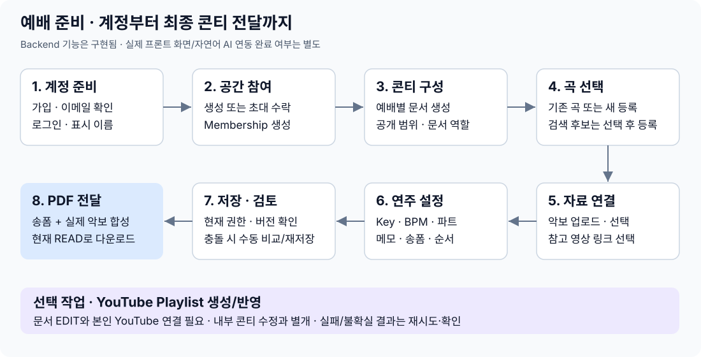

# 1. 이 서비스는 누가, 어떻게 사용하나요?

2026-10-07 · 비개발자용 · 제품 설명과 현재 구현의 차이를 함께 표시합니다.

정책 원본은 PROJECT_DESIGN.md이며, 상황별 권한 질문은 [권한 참고서](user_authorization_policy.md)에서 찾을 수 있습니다. 아래는 현재 Backend 사용 흐름입니다. 검증 완료 상태와 운영 전 결정은 PROJECT에서 확인합니다.

## 어떤 서비스인가요?

찬양팀이 예배를 준비하면서 **곡 순서, 악보, 송폼, 연주 설정, 메모, 참고 영상**을 한 콘티에 모으고 함께 수정하는 서비스입니다. V1은 찬양 콘티 준비에 집중합니다. 설교·주보 작성이나 예배 당일 실시간 진행 도구는 포함하지 않습니다.

이 문서에서는 민지와 준호가 찬양팀의 주일 예배를 준비하는 상황을 예로 듭니다. 사람의 직분이나 악기 담당이 시스템 권한을 자동으로 정하지는 않습니다.

## 먼저 알아둘 이름

| 이름 | 쉬운 뜻 | 예시 |
|---|---|---|
| User | 서비스에 가입한 사람의 계정 | 민지의 계정 |
| Workspace | 구성원과 자료를 함께 관리하는 작업 공간 | 은혜교회 찬양팀 |
| Membership | 누가 어느 공간에 참여 중인지 나타내는 기록 | 민지가 찬양팀에 참여 중 |
| 콘티 / Setlist | 한 예배에서 사용할 곡과 준비 내용을 묶은 구성 | 10월 4일 주일 예배 |
| Song | 여러 콘티에서 다시 사용하는 곡 정보 | ‘주 사랑’이라는 곡 |
| 콘티 항목 / SetlistItem | 이번 예배에서 그 곡을 어떻게 사용할지 | ‘주 사랑’을 G Key, 80 BPM으로 연주 |
| Score | 사용자가 확보해 업로드한 악보 파일 | 주 사랑.pdf |
| Reference | 참고할 영상이나 자료의 링크 | 이번에 참고할 YouTube 영상 |
| SongForm | 곡의 구간 순서·반복·진행 지시 | Verse → Chorus 두 번 → Ending |

현재는 Backend 기능이 마련되어 있습니다. 아래 행동을 제공할 실제 프론트 화면과 자연어 AI 연결의 완성 여부는 별도이며, 이 저장소만으로 다른 담당자의 진척을 알 수 없습니다.

## 1단계. 계정 만들기와 관리

| 사용자가 하는 일 | 서비스가 처리하는 일 | 알아둘 점 |
|---|---|---|
| 이메일·비밀번호로 가입 | 계정 생성, 이메일 확인 안내 발송 요청 | 이메일 확인 전에는 비밀번호 로그인·공간 생성 불가 |
| 이메일 확인 | 확인 링크의 일회용 값을 검사하고 소유권 등록 | 만료됐다면 확인 메일을 다시 요청 |
| 로그인 | 확인된 대표 이메일과 비밀번호 검사 | Google 로그인도 별도 설정 시 지원 |
| 비밀번호를 잊음 | 재설정 메일 요청 → 확인 → 새 비밀번호 저장 | 재설정 후 기존 로그인 상태 종료 |
| 다른 이메일 추가 | 추가 주소로 확인 요청 → 확인 후 사용 | 초대받은 주소가 대표 이메일과 달라도 확인 후 수락 가능 |
| 대표 이메일 변경·이메일 제거 | 본인 확인과 남은 로그인 수단 검사 | 로그인 수단을 모두 없애는 변경은 거부 |
| Google 계정 연결·해제 | 로그인한 본인의 계정에 명시적으로 연결/해제 | 이메일이 같다는 이유만으로 기존 계정과 합치지 않음 |
| 비밀번호 변경·추가·제거 | 기존 비밀번호 또는 최근 본인 확인 검사 | Google만 쓰던 계정도 비밀번호 추가 가능 |
| 로그아웃 | 현재 브라우저의 로그인 상태 종료 | 다른 공간의 소속을 탈퇴하는 것과는 다름 |
| 표시 이름 설정 | 구성원 목록에서 사용할 이름을 저장 | 구성원끼리 이름만 공유. 같은 이름이어도 같은 계정이 아니며 타인의 이메일은 공개하지 않음 |

보안을 위한 최근 본인 확인은 비밀번호나 Google로 다시 자신임을 확인하는 과정입니다. 어떤 작업에 필요한지는 [인증·권한 흐름](auth-flows.md)에 설명합니다.

## 2단계. 찬양팀 공간 만들기와 참여하기

| 사람 | 하는 일 | 결과 |
|---|---|---|
| 민지 | 이메일 확인 후 ‘은혜교회 찬양팀’ 생성 | 이 공간의 ADMIN |
| 민지 | 준호의 이메일로 초대 | 소속을 바로 만드는 것이 아니라 초대 발급 |
| 준호 | 초대 주소의 소유권 확인 후 수락 | 이 공간의 ACTIVE MEMBER |

활성 공간에는 ADMIN이 정확히 한 명입니다. ADMIN은 구성원을 초대하고, 초대를 다시 보내거나 취소하며, MEMBER를 제거할 수 있습니다. ADMIN을 넘기면 준호가 ADMIN, 민지는 MEMBER가 됩니다. 문서 권한은 그대로이며 준호에게 서비스 내 알림이 생깁니다. 별도로 ADMIN을 늘리거나 강등·제거하는 기능은 없습니다.

한 사람은 여러 공간에 참여할 수 있고, 공간마다 역할이 다를 수 있습니다. 공간을 나가면 그 공간의 자료에 접근할 수 없습니다. 다시 초대받아 참여해도 이전 문서 권한을 자동으로 되찾지는 않습니다.

## 3단계. 이번 주 콘티 만들고 협업자 정하기

민지가 ‘주일 예배’ 콘티를 만들면 그 콘티의 MANAGER가 됩니다. Workspace의 ADMIN/MEMBER와는 다른 권한입니다.

| 문서 역할 | 가능한 작업 |
|---|---|
| MANAGER | 보기·수정·PDF 생성, 다른 사람의 문서 권한 및 공개 범위 관리 |
| EDITOR | 보기·수정·PDF 생성 |
| VIEWER | 보기·기존 결과물 다운로드 |

| 공개 범위 | 누구에게 보이나요? |
|---|---|
| OPEN | 해당 공간의 참여 중인 구성원 모두. 권한을 따로 받지 않은 사람은 보기만 가능 |
| RESTRICTED | 해당 공간 구성원 중 문서 권한을 받은 사람만. 공간 ADMIN도 예외 아님 |

OPEN은 인터넷 공개가 아닙니다. MANAGER는 구성원에게 역할을 부여·변경·회수하고 공개 범위를 변경할 수 있습니다. 단, 문서 관리 책임자가 아무도 남지 않는 변경은 막습니다.

## 4단계. 곡 고르기 — DB에 없어도 되나요?

| 상황 | 다음 행동 |
|---|---|
| 공간에 ‘주 사랑’이 등록되어 있음 | 기존 곡 선택 → 이번 콘티의 항목 생성 |
| 아직 등록되어 있지 않음 | 외부 후보 검색 또는 직접 등록 → 사용자가 고른 곡을 등록·추가 |

외부 검색은 연동된 YouTube 자료를 통해 후보를 찾는 방식입니다. 연동이 설정되지 않으면 검색이 불가하다고 알려줍니다. 검색 결과를 보여줬다는 이유만으로 모두 DB에 저장하지 않습니다. 사용자가 선택한 곡을 기존 곡과 연결하거나 새로 등록해 작업합니다.

동일 제목의 곡이 여러 개일 수 있어 제목만으로 같은 곡이라고 단정하지 않습니다. 곡은 공간 안에서 재사용하며 서비스 전체 공용 곡 목록을 만들지는 않습니다.

“주 사랑 넣어줘” 같은 자연어를 해석해 이 행동을 이어주는 AI 기능은 아직 별도 구현 대상입니다. 지금 마련된 것은 AI가 호출할 Backend 기능입니다.

## 5단계. 악보와 참고 영상 연결하기

| 작업 | 사용 흐름 |
|---|---|
| 새 악보 사용 | 확보한 PDF/PNG/JPEG 업로드 → 공간 자료로 등록 → 이번 콘티 항목에서 선택 |
| 기존 악보 사용 | 공간의 업로드 자료 목록 → 이번 항목에 사용할 악보 선택 |
| 악보 다운로드 | 공간에 참여 중인 구성원이 업로드 원본 다운로드 |
| 링크 직접 등록 | URL·선택적 제목 입력 → 공간 참고자료로 등록 → 이번 항목에서 선택 |
| 영상 검색 | YouTube 후보 검색 → 영상 선택·등록 → 이번 항목에 연결 |
| 이번 예배의 링크 변경 | 다른 자료를 새로 등록하거나 기존 자료 선택 → 이번 항목의 선택 교체 |
| 악보·링크 선택 해제 | 항목에서 연결만 해제. 공간에 등록된 원본 자료를 삭제하는 동작은 아님 |

예: 같은 ‘주 사랑’을 주일에는 a 영상, 수요일에는 b 영상으로 참고할 수 있습니다. 선택은 곡 자체가 아니라 **각 콘티의 곡 항목**에 저장합니다. V1은 새 자료 등록 또는 기존 자료 선택으로 교체하며, 공유 참고자료 자체의 URL·제목 편집은 제공하지 않습니다.

악보를 서비스가 인터넷에서 수집하는 기능은 없습니다. 업로드는 파일 내용·형식·크기를 검사합니다. 실제 악보 저작권을 사용할 수 있다는 보증은 아닙니다.

## 6단계. 연주 설정·송폼·순서 작성과 저장

| 입력/행동 | 예시 | 저장되는 범위 |
|---|---|---|
| Key / BPM | G / 80 | 이번 콘티의 해당 곡 |
| 파트 | 피아노, 기타, 보컬 | 이번 항목의 연주 파트. 계정 권한과 무관 |
| 항목 메모 | 두 번째 후렴부터 드럼 | 이번 항목 |
| 송폼 | Verse → Chorus ×2 → Ending | 구간별 반복·큐·Calling·메모와 순서 |
| 콘티 전체 메모 | 시작 전 기도 | 이번 콘티 전체 |
| 곡 삭제·순서 변경 | 3번 곡을 1번으로 | 이번 콘티. 재사용 곡 목록의 곡 삭제가 아님 |

동시에 수정할 때: 민지와 준호가 같은 저장본을 열고 민지가 먼저 저장하면, 준호의 예전 저장본으로 덮어쓰는 요청은 거부합니다. 화면은 준호의 입력을 유지하고, 권한이 있으면 최신 내용을 따로 보여준 뒤 비교·복사하여 수동으로 다시 저장해야 합니다. 이것은 프론트 구현 요구이며 Backend의 거부 테스트만으로 화면 완료를 뜻하지 않습니다. 실시간 자동 병합과 브라우저 종료 후 초안 복구는 V1 범위가 아닙니다.

## 7단계. YouTube Playlist 만들기

1. 공개 영상 검색과는 별도로, 내 YouTube 계정에 Playlist를 만들 권한을 연결합니다.
2. 수정 권한이 있는 콘티의 저장본을 선택해 생성하거나 기존 Playlist에 반영합니다.
3. 콘티 항목에 선택된 YouTube 영상들을 곡 순서에 맞춰 사용합니다. 일반 URL은 영상 항목이 아닙니다.
4. 실패하면 처리 상태를 확인하고 재시도합니다. 응답을 못 받았다고 무조건 새 Playlist를 만들어 중복시키지는 않습니다.

YouTube 작업이 실패해도 이미 저장한 콘티는 사라지지 않습니다. 연결을 해제하면 서비스의 사용 권한을 제거하며, YouTube 측 권한 취소 실패는 별도로 알립니다. Google 로그인과 YouTube 작업 권한은 서로 다릅니다.

## 8단계. 최종 결과물 다운로드와 전달

**2026-10-07: Backend PDF는 안내·송폼과 선택한 실제 악보 전체 페이지를 함께 출력합니다.** 임시 페이지 구성 기준이며 프론트 다운로드 버튼·최종 화면 승인과는 구분합니다.

| 동작/내용 | 현재 구현 |
|---|---|
| 저장된 콘티 버전을 기준으로 PDF 생성·재시도 | EDITOR/MANAGER 가능 |
| 곡 순서·Key/BPM·파트·메모·송폼·참고 링크 출력 | 포함 |
| 선택한 실제 악보 페이지 포함 | PDF 전체 페이지·회전 유지, PNG/JPEG 이미지 포함. 곡별 안내 뒤 해당 악보 배치 |
| 생성된 PDF를 브라우저로 다운로드 | Backend API 있음. 프론트 버튼 연결은 별도 |
| 생성 결과 목록·메타데이터·상태 조회 | 현재 문서 조회 권한으로 확인 |
| 원문 수정 후 이전 PDF | 기존 파일은 변경되지 않음. 새 내용은 새 결과물 생성 |
| 공간 밖의 사람에게 전달 | 내려받은 파일 자체를 전달. 문서 접근권한이나 공개 링크를 부여하지 않음 |

악보를 송폼 순서대로 잘라 재배열하거나 편집하는 기능은 아닙니다. 생성 실패 시 상태를 확인하고 같은 입력으로 재시도하며, 현재 선택이 바뀌어도 기존 명령의 악보 선택은 바뀌지 않습니다. 프론트 버튼 연결은 별도입니다.

## 9단계. 공간 나가기·회원탈퇴

| 행동 | 결과 | 막히는 경우 |
|---|---|---|
| 공간 나가기 | 그 공간의 참여 기록을 종료하고 접근 중단 | ADMIN이거나 문서의 유일 MANAGER이면 먼저 책임 이전 |
| ADMIN이 MEMBER 제거 | 영향 확인 후 필요한 문서의 MANAGER를 ADMIN에게 부여하고 소속 종료 | 다른 MANAGER가 있으면 승계 없음. 확인 뒤 영향이 바뀌면 재확인 |
| 서비스 회원탈퇴 | 모든 공간 소속 종료, 계정 비활성, 로그인 수단 제거 | 어느 한 공간/문서라도 책임 이전이 필요하면 전체 탈퇴 거부 |
| ADMIN이 공간 종료 | 구성원 수와 무관하게 모든 소속 종료·미수락 초대 취소·서비스 내 종료 알림 | 영향·주의사항 확인과 공간 이름 재입력 필요. 확인 뒤 변화가 있으면 재확인 |

자발적 탈퇴 전 책임 이전은 다른 MEMBER에게 ADMIN을 넘기거나, 다른 참여 중인 구성원에게 해당 문서 MANAGER를 부여하는 것입니다. MEMBER 강제 제거 때만 확인 후 자동 승계 예외를 사용합니다. 권한 없는 제한 문서는 제목 대신 영향 수만 안내합니다.

종료한 공간은 일반 목록·자료·구성원 조회에서 사라집니다. 종료 당시 구성원만 본인 계정에서 최소 종료 알림과 시각을 확인합니다. 이미 내려받은 파일은 회수하지 못하며 외부 작업이 일부 반영됐을 수 있습니다. 종료는 즉시 영구 삭제가 아니고 V1 재개·복구는 없으며 운영자 복구도 보장하지 않습니다.

**운영 전 남은 결정:** 탈퇴·종료 이후 데이터별 보존 기간, 삭제/익명화 방식, 파일·백업 처리입니다. 현재 회원탈퇴가 모든 개인정보의 완전한 삭제를 뜻하지는 않습니다.

결정 상태의 원본은 [PROJECT의 Decisions Needed — D-04/D-05](../../../PROJECT.md#decisions-needed)입니다. 여기서 삭제 권한이나 보존 기간을 새로 정한 것은 아닙니다.

## 현재 어디까지 됐나요?

Backend는 주요 기능과 실제 악보 포함 PDF, 새 권한 정책의 구현을 갖췄습니다. 최신 검증 완료 단계는 PROJECT에서 확인합니다. 실제 화면, AI 연결, 실제 외부 연동·배포·운영 부하 검증은 별도입니다. Harness·도메인 개념 모델·User–Membership–Workspace는 Backend에 적용되어 있습니다.

다음 읽기: 구현이 궁금하면 [2. 구현 구조](architecture.md), 권한이 궁금하면 [4. 인증·권한](auth-flows.md). 원본 정책과 미정 결정은 [PROJECT](../../../PROJECT.md)에 유지합니다.
